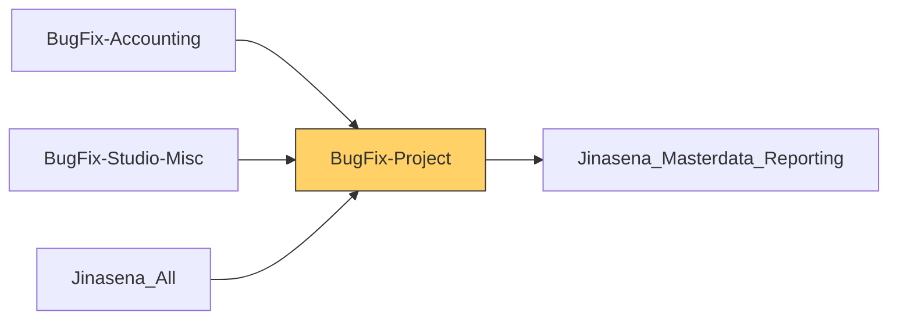

# Functional Documentation — BugFix-Project

> Generated by `scripts/generate_functional_docs.py` from branch `Visual_Migration_02` (commit 1da433a 2026-10-06) and the installed module on the clean environment. For every attribute: **Function** = what it does, **Depends on** = the attributes it relies on (owning module in brackets when it is not this repo), **Used by** = the attributes in any Jinasena repo that rely on it.

| Item | Value |
|---|---|
| Technical name | `BugFix-Project` |
| Title | Jinasena : Module : Project |
| Version | `17.0.0.0.63` |
| Category | Services/Project |
| License | LGPL-3 |
| Installed on environment | installed 17.0.0.0.63 |
| History | [CHANGELOG.md](CHANGELOG.md) |

## Purpose

<!-- SUMMARY:repo -->
BugFix-Project is the Studio-to-Python port of Jinasena's Project app customizations. It serves two groups: project managers running customer projects (project documents, cash advances, month-end entries, project updates with gross-margin reports) and the repair team, whose field-service tasks carry the repair photos, warranty card and the status flags that drive the repair helpdesk ticket pipeline in Fix-repair. It also owns the lookup models used to classify projects and their costs. Several ported buttons and automations lost their links during porting, so some server actions exist without being reachable.

- Projects: document and image uploads, Project Group, Quotation Type, repair flag, and cash advance bill, issue and settlement actions.
- Repair tasks: Repair Image and Warranty Card tabs, priority, repair reasons, and computed flags on the linked sales order (confirmed, delivered, invoiced, material ready, quick repair) read by the helpdesk ticket.
- Project updates: Pending or Completed status, validations, and an auto-generated Project Gross Margin report with financial progress and estimated and actual GP.
- Lookup models: Departments, Project Category, Project Category Group and Project Groups, under Project Configuration.
- Ported record rules for projects, tasks, milestones, stages and updates, plus window actions, menus and defaults.
- Install hook that seeds missing selection values.
<!-- /SUMMARY -->

## Module dependencies

| Kind | Modules |
|---|---|
| Odoo standard / enterprise | `base_setup`, `project` |
| Jinasena repos | `Jinasena_Masterdata_Reporting` |
| Third-party apps |  |
| Used by (Jinasena repos that depend on this one) | `BugFix-Accounting`, `BugFix-Studio-Misc`, `Jinasena_All` |



## Contents at a glance

| Attribute type | Count |
|---|---|
| Models created | 4 |
| Models extended | 6 |
| Fields | 189 |
| Views | 33 |
| Window actions | 22 |
| Server actions | 16 |
| Automations | 5 |
| Menus | 10 |
| Mail templates | 1 |
| Access rights | 11 |
| Record rules | 20 |
| Install hooks | 2 |
| Migration scripts | 3 |

## Models

| Model | Description | Created / extends | Fields | Views | Actions + automations | Approvals |
|---|---|---|---|---|---|---|
| `project.milestone` | Project Milestone | extends (project) | 0 | 0 | 0 | 0 |
| `project.project` | Project | extends (project) | 17 | 5 | 4 | 0 |
| `project.project.stage` | Project Stage | extends (project) | 0 | 0 | 0 | 0 |
| `project.task` | Task | extends (project) | 24 | 4 | 7 | 0 |
| `project.update` | Project Update | extends (project) | 5 | 4 | 10 | 0 |
| `x_departments` | Departments | created | 36 | 4 | 0 | 0 |
| `x_project_category` | Project Category | created | 37 | 4 | 0 | 0 |
| `x_project_category_gro` | Project Category Group | created | 36 | 4 | 0 | 0 |
| `x_project_groups` | Project Groups | created | 34 | 4 | 0 | 0 |
| `x_sales_report_model` | Sales Report Model | extends (Jinasena_Masterdata_Reporting) | 0 | 4 | 0 | 0 |

### `project.milestone` — Project Milestone

*Extends a model created by `project`.*

Other repos that use this model: `server action BugFix-Studio-Misc.server_action_2799_mst_odoo_data_clean_up` (BugFix-Studio-Misc)<br>`window action BugFix-Studio-Misc.act_window_2805_project_milestone_d7` (BugFix-Studio-Misc)

**Summary:**

<!-- SUMMARY:model:project.milestone -->
This repo adds no fields or logic to project milestones. It ships a window action and the record rules for milestones ported from the Studio database: managers see all, internal users need to follow follower-only projects, portal users read through project sharing, and a global multi-company rule.
<!-- /SUMMARY -->

**Window actions (1):**

| Name | Record name | Function | Depends on | Used by |
|---|---|---|---|---|
| project.milestone | `act_window_2805_project_milestone` | Opens **Project Milestone** records (tree,form). | `model project.milestone` (project) | `menu BugFix-Studio-Misc.menu_f6_project_milestone` (BugFix-Studio-Misc) |

**Record rules (4):**

| Name | Record name | Function | Depends on | Used by |
|---|---|---|---|---|
| Project/Milestone: Project manager can see all project milestones | `rule_409_project_milestone_project_manager_can_see_all_project_milest` | For Project / Administrator: read/write/create/delete on Project Milestone with no record filter (empty domain = all records). | `group project.group_project_manager` (project)<br>`model project.milestone` (project) |  |
| Project/Milestone: employees: follow required for follower-only projects | `rule_408_project_milestone_employees_follow_required_for_follower_onl` | For User types / Internal User: read/write/create/delete on Project Milestone only where `[
        '|',
            ('project_id.privacy_visibility', '!=', 'followers'),
            '|',
                ('project_id.message_partner_ids', 'in', [user.partner_id.id]),
                ('project_id.user_id', '=', user.id),
        ]`. | `group base.group_user` (base)<br>`model project.milestone` (project)<br>`project.milestone.project_id` (project)<br>`project.project.message_partner_ids` (project)<br>`project.project.privacy_visibility` (project)<details><summary>+1 more</summary>`project.project.user_id` (project)</details> |  |
| Project/Milestone: multi-company | `rule_407_project_milestone_multi_company` | For everyone (global rule): read/write/create/delete on Project Milestone only where `['|', ('project_id.company_id', 'in', company_ids), ('project_id.company_id', '=', False)]`. | `model project.milestone` (project)<br>`project.milestone.project_id` (project)<br>`project.project.company_id` (project) |  |
| Project/milestone portal users: portal user can read with project sharing feature | `rule_688_project_milestone_portal_users_portal_user_can_read_with_pro` | For User types / Portal: read/write/create/delete on Project Milestone only where `[
            ('project_id.privacy_visibility', '=', 'portal'),
            ('project_id.collaborator_ids.partner_id', 'in', [user.partner_id.id]),
        ]`. | `group base.group_portal` (base)<br>`model project.milestone` (project)<br>`project.collaborator.partner_id` (project)<br>`project.milestone.project_id` (project)<br>`project.project.collaborator_ids` (project)<details><summary>+1 more</summary>`project.project.privacy_visibility` (project)</details> |  |

### `project.project` — Project

*Extends a model created by `project`.* Python: `models/project_project.py`.

Other repos that use this model: `account.bank.statement.line.x_studio_created_from_project_no` (BugFix-Accounting)<br>`account.bank.statement.line.x_studio_many2one_field_B4ibh` (BugFix-Accounting)<br>`account.bank.statement.line.x_studio_many2one_field_P4o2n` (BugFix-Accounting)<br>`account.bank.statement.line.x_studio_many2one_field_R46Ke` (BugFix-Accounting)<br>`account.bank.statement.line.x_studio_many2one_field_tpCkS` (BugFix-Accounting)<br>`account.bank.statement.line.x_studio_many2one_field_vAeTQ` (BugFix-Accounting)<br>`account.bank.statement.line.x_studio_project_no_1` (BugFix-Accounting)<br>`account.bank.statement.line.x_studio_project_no_bill` (BugFix-Accounting)<details><summary>+34 more</summary>`account.bank.statement.line.x_studio_project_no_issue` (BugFix-Accounting)<br>`account.bank.statement.line.x_studio_project_no_settle_1` (BugFix-Accounting)<br>`account.bank.statement.line.x_studio_project_no_settle` (BugFix-Accounting)<br>`account.bank.statement.line.x_studio_project_no` (BugFix-Accounting)<br>`account.move.line.x_studio_project_no` (BugFix-Accounting)<br>`account.move.x_studio_created_from_project_no` (BugFix-Accounting)<br>`account.move.x_studio_project_no_bill` (BugFix-Accounting)<br>`account.move.x_studio_project_no_issue` (BugFix-Accounting)<br>`account.move.x_studio_project_no_settle` (BugFix-Accounting)<br>`account.move.x_studio_project_no` (BugFix-Accounting)<br>`account.payment.x_studio_created_from_project_no` (BugFix-Accounting)<br>`account.payment.x_studio_many2one_field_B4ibh` (BugFix-Accounting)<br>`account.payment.x_studio_many2one_field_P4o2n` (BugFix-Accounting)<br>`account.payment.x_studio_many2one_field_R46Ke` (BugFix-Accounting)<br>`account.payment.x_studio_many2one_field_tpCkS` (BugFix-Accounting)<br>`account.payment.x_studio_many2one_field_vAeTQ` (BugFix-Accounting)<br>`account.payment.x_studio_project_no_1` (BugFix-Accounting)<br>`account.payment.x_studio_project_no_bill` (BugFix-Accounting)<br>`account.payment.x_studio_project_no_issue` (BugFix-Accounting)<br>`account.payment.x_studio_project_no_settle_1` (BugFix-Accounting)<br>`account.payment.x_studio_project_no_settle` (BugFix-Accounting)<br>`account.payment.x_studio_project_no` (BugFix-Accounting)<br>`crossovered.budget.x_studio_project_no` (BugFix-Accounting)<br>`sale.order._fix_repair_auto_generate_quotation_type()` (Fix-repair)<br>`sale.order.line.x_studio_main_project_2` (BugFix-Sales)<br>`sale.order.line.x_studio_main_project_no` (BugFix-Sales)<br>`sale.order.line.x_studio_project_no_1` (BugFix-Sales)<br>`sale.order.line.x_studio_project_no` (BugFix-Sales)<br>`sale.order.x_studio_main_project_2` (BugFix-Sales)<br>`sale.order.x_studio_main_project_no` (BugFix-Sales)<br>`sale.order.x_studio_project_no` (BugFix-Sales)<br>`server action BugFix-Studio-Misc.server_action_2799_mst_odoo_data_clean_up` (BugFix-Studio-Misc)<br>`x_sales_report_model.x_studio_project_no` (Jinasena_Masterdata_Reporting)<br>`x_temp_estimated.x_studio_project_no` (BugFix-Accounting)</details>

**Summary:**

<!-- SUMMARY:model:project.project -->
This repo adds three document and three image upload fields on a Project Related Documents tab, a read-only Project Group and Quotation Type, and a Repair Project checkbox. Server actions open a prefilled cash advance bill, a supplier advance payment or a settlement journal entry for the project, and another creates month-end entries for unposted Project Gross Margin reports; the header buttons for these were stripped during porting, so the form-button view has no effect. Several smart-button counters and the Valid GM flag were ported without a compute and always show 0 or unchecked. The repo also ships project window actions, menus, gantt views, an ID column in the list and the ported project record rules.
<!-- /SUMMARY -->

**Fields (17):**

| Field | Label | Type | Function | How it gets its value | Depends on | Used by |
|---|---|---|---|---|---|---|
| `x_studio_document_1` | Document 1 | binary | First project document file, uploaded by the user in the Documents section of the Project Related Documents tab on the project form. | stored |  | `view BugFix-Project.ported_view_4748_odoo_studio_project_project_form_customi` |
| `x_studio_document_2` | Document 2 | binary | Second project document file, uploaded by the user in the Documents section of the Project Related Documents tab on the project form. | stored |  | `view BugFix-Project.ported_view_4748_odoo_studio_project_project_form_customi` |
| `x_studio_document_3` | Document 3 | binary | Third project document file, uploaded by the user in the Documents section of the Project Related Documents tab on the project form. | stored |  | `view BugFix-Project.ported_view_4748_odoo_studio_project_project_form_customi` |
| `x_studio_image_1` | Image 1 | binary | First project image, uploaded in the Images section of the Project Related Documents tab on the project form. | stored |  | `view BugFix-Project.ported_view_4748_odoo_studio_project_project_form_customi` |
| `x_studio_image_2` | Image 2 | binary | Second project image, uploaded in the Images section of the Project Related Documents tab on the project form. | stored |  | `view BugFix-Project.ported_view_4748_odoo_studio_project_project_form_customi` |
| `x_studio_image_3` | Image 3 | binary | Third project image, uploaded in the Images section of the Project Related Documents tab on the project form. | stored |  | `view BugFix-Project.ported_view_4748_odoo_studio_project_project_form_customi` |
| `x_studio_project_group` | Project Group | many2one → `x_project_groups` | Project Group the project belongs to, shown read-only on the project form; sales order actions in BugFix-Sales copy it from the order's project onto the order. | stored | `model x_project_groups` | `view BugFix-Project.ported_view_4748_odoo_studio_project_project_form_customi` |
| `x_studio_quotation_type` | Quotation Type | selection: Sales=Sales; Project=Project; Repair=Repair | Read-only quotation type of the project (Sales, Project or Repair), shown on the project form after Allocated Hours. | stored |  | `view BugFix-Project.ported_view_4748_odoo_studio_project_project_form_customi` |
| `x_studio_repair_project` | Repair Project | boolean | Checkbox on the project form that marks the project as a repair project; set manually and not used by any logic in this repo. | stored |  | `view BugFix-Project.ported_view_4748_odoo_studio_project_project_form_customi` |
| `x_studio_valid_gm` | Valid GM | boolean | Intended flag that the project has a valid gross-margin report; ported as a non-stored field with no compute, so it is always unchecked. Kept as a hidden, read-only field on the project form. | not stored |  | `view BugFix-Project.ported_view_4748_odoo_studio_project_project_form_customi` |
| `x_x_studio_created_from_project_no_account_move_count` | Created From Project No count | integer | Intended Studio smart-button count of journal entries created from this project; ported as a plain non-stored integer with no compute, so it always shows 0. | not stored |  |  |
| `x_x_studio_main_project_2_sale_order_line_count` | Main Project 2 count | integer | Intended Studio smart-button count of sales order lines whose Main Project 2 is this project; ported as a plain non-stored integer with no compute, so it always shows 0. | not stored |  |  |
| `x_x_studio_project_no_account_move_line_count` | Project No count | integer | Intended Studio smart-button count of journal items linked to this project; ported as a plain non-stored integer with no compute, so it always shows 0. | not stored |  |  |
| `x_x_studio_project_no_bill_account_move_count` | Project No Bill count | integer | Intended Studio smart-button count of cash advance bills raised for this project; ported as a plain non-stored integer with no compute, so it always shows 0. | not stored |  |  |
| `x_x_studio_project_no_issue_account_move_count` | Project No Issue count | integer | Intended Studio smart-button count of issued cash advances for this project; ported as a plain non-stored integer with no compute, so it always shows 0. | not stored |  |  |
| `x_x_studio_project_no_settle_account_move_count` | Project No Settle count | integer | Intended Studio smart-button count of cash advance settlements for this project; ported as a plain non-stored integer with no compute, so it always shows 0. | not stored |  |  |
| `x_x_studio_project_no_x_sales_report_model_count` | Project No count | integer | Intended Studio smart-button count of sales/gross-margin reports linked to this project; ported as a plain non-stored integer with no compute, so it always shows 0. | not stored |  |  |

**Server actions (4):**

- **Project - Create Cash Advance Bills** (`server_action_2731_project_create_cash_advance_bills`, type `code`)
  - Function: Opens a new vendor bill in a popup, prefilled as an Advance Payment bill linked to this project (journal ID 40, journal type Bill).
  - Depends on: `model project.project` (project)
  - Used by: — (not linked to a button, menu or automation)
  <details><summary>code (13 lines)</summary>

```python
ctx = env.context

ctx.update({'default_x_studio_created_from_project':True,'default_x_studio_project_no_bill':record.id,'default_x_studio_project_no':record.id,'default_x_studio_journal_type':'Bill','default_journal_id':40,'default_move_type':'in_invoice','default_x_studio_type':'Advance Payment'})

action = {
          'name': 'Cash Advance Bills',
          'type': 'ir.actions.act_window',
          'res_model': 'account.move',
          'view_mode': 'form',
          'view_type': 'form',
          'target': 'new',
          'context': ctx,
          }
```
  </details>
- **Project - Issue Cash Advances** (`server_action_2732_project_issue_cash_advances`, type `code`)
  - Function: Opens a new supplier payment in a popup, prefilled as an Advance Payment issued against this project (journal ID 2).
  - Depends on: `model project.project` (project)
  - Used by: — (not linked to a button, menu or automation)
  <details><summary>code (13 lines)</summary>

```python
ctx = env.context

ctx.update({'default_x_studio_created_from_project_1':True,'default_x_studio_project_no_issue':record.id,'default_x_studio_project_no_1':record.id,'default_partner_type':'supplier','default_journal_id':2,'default_x_studio_type':'Advance Payment'})

action = {
          'name': 'Issue Cash Advances',
          'type': 'ir.actions.act_window',
          'res_model': 'account.payment',
          'view_mode': 'form',
          'view_type': 'form',
          'target': 'new',
          'context': ctx,
          }
```
  </details>
- **Project - Settle Cash Advances** (`server_action_2733_project_settle_cash_advances`, type `code`)
  - Function: Opens a new journal entry in a popup, prefilled as an Advance Payment settlement for this project (journal ID 3, journal type Settlement).
  - Depends on: `model project.project` (project)
  - Used by: — (not linked to a button, menu or automation)
  <details><summary>code (13 lines)</summary>

```python
ctx = env.context

ctx.update({'default_x_studio_created_from_project':True,'default_x_studio_project_no_settle':record.id,'default_x_studio_project_no':record.id,'default_x_studio_journal_type':'Settlement','default_journal_id':3,'default_move_type':'entry','default_x_studio_type':'Advance Payment'})

action = {
          'name': 'Settle Cash Advances',
          'type': 'ir.actions.act_window',
          'res_model': 'account.move',
          'view_mode': 'form',
          'view_type': 'form',
          'target': 'new',
          'context': ctx,
          }
```
  </details>
- **Project - Update Month End Entries - 2** (`server_action_2119_project_update_month_end_entries_2`, type `code`)
  - Function: For each auto-generated Project Gross Margin report not yet posted, creates a month-end journal entry (journal ID 15) with fixed 100 debit/credit lines on the Imports Ledger Setup accounts and marks it done. Errors if accounts are missing or nothing is pending.
  - Depends on: `model account.move` (account), `model project.project` (project), `model x_imports_ledger_setup` (BugFix-Purchase), `model x_sales_report_model` (Jinasena_Masterdata_Reporting)
  - Used by: — (not linked to a button, menu or automation)
  <details><summary>code (24 lines)</summary>

```python
valid_gm = env['x_sales_report_model'].search([('x_studio_report_code', '=', 'Project Gross Margin'),('x_studio_project_no', '=', record.id),('x_studio_auto_generated', '=', True),('x_studio_month_end_entry_updated', '=', False)])

if valid_gm:
  gm_account = env['x_imports_ledger_setup'].search([('id', '=', 1)], limit=1)
  if gm_account:
    if gm_account.x_studio_vendor_despatch_debit_account.id == 0 or gm_account.x_studio_vendor_despatch_credit_account.id == 0:
      raise UserError('Month End Accounts must be Specified in Imports Ledger Setup')
  
  for valid_gm_lines in valid_gm:
    gm_lines=[]
    gm_lines.append([0,0,{
      'account_id':gm_account.x_studio_vendor_despatch_debit_account.id,
      'name':'Project Month End Entry',
      'debit':100}])
                
    gm_lines.append([0,0,{
      'account_id':gm_account.x_studio_vendor_despatch_credit_account.id,
      'name':'Project Month End Entry',
      'credit':100}])	
              
    gm_entry = env['account.move'].create({'x_studio_created_from_project_no':record.id,'journal_id':15,'move_type':'entry','line_ids':gm_lines})
    valid_gm_lines.write({'x_studio_month_end_entry_updated': True}) 
else:
  raise UserError("There are no month end entries to be processed.")
```
  </details>
**Window actions (6):**

| Name | Record name | Function | Depends on | Used by |
|---|---|---|---|---|
| Projects (project.project) | `aw_f4_project_project_projects_project_project` | Opens **Project** records (kanban,tree,form,gantt). | `model project.project` (project) |  |
| Projects (project.project) | `action_2877_projects_project_project` | Opens **Project** records (kanban,tree,form,gantt). | `model project.project` (project) | `menu BugFix-Project.menu_f6_projects_project_project` |
| Projects (project.project) | `act_window_2877_projects_project_project` | Opens **Project** records (kanban,tree,form,gantt). | `model project.project` (project) | `menu BugFix-Studio-Misc.menu_f6r2_test_app_05_projects_projects_project_project` (BugFix-Studio-Misc) |
| project.project | `aw_f4_project_project_project_project` | Opens **Project** records (kanban,tree,form,gantt). | `model project.project` (project) | `menu BugFix-Project.menu_f6_project_project`<br>`menu BugFix-Studio-Misc.menu_f6r2_test_app_05_projects_project_project` (BugFix-Studio-Misc) |
| project.project | `action_2619_project_project` | Opens **Project** records (kanban,tree,form,gantt). | `model project.project` (project) |  |
| project.project | `act_window_2619_project_project` | Opens **Project** records (kanban,tree,form,gantt). | `model project.project` (project) |  |

**Views (5):**

| Name | Record name | Type | What it changes | Function | Depends on | Used by |
|---|---|---|---|---|---|---|
| Default gantt view for project.project | `ported_default_gantt_view_f_fe6aa571_bf0f_4a65_9eba_73ad101e85fc` | gantt | full gantt layout with 0 fields | Gantt view of projects that uses Created on as both start and end date, so every project is a zero-length bar. Duplicate of view 4931. |  |  |
| Default gantt view for project.project | `view_4931_default_gantt_view_for_project_project_e` | gantt | full gantt layout with 0 fields | Gantt view of projects that uses Created on as both start and end date. Duplicate of the ported gantt view. |  |  |
| Odoo Studio: project.project.form customization | `ported_view_4748_odoo_studio_project_project_form_customi` | form | after `//button[@name='action_view_tasks']`: add ; after `//field[@name='allocated_hours']`: add field activity_user_id, field x_studio_project_group, field x_studio_quotation_type, field x_studio_valid_gm, field x_studio_repair_project; inside `//form[1]/sheet[1]/notebook[1]`: add page 'Project Related Documents' | On the project form, adds Activity responsible user, Project Group, Quotation Type, hidden Valid GM and Repair Project after Allocated Hours, plus a Project Related Documents tab with 3 documents and 3 images. Its cash-advance and report smart buttons were stripped. | `project.project.activity_user_id` (project)<br>`project.project.x_studio_document_1`<br>`project.project.x_studio_document_2`<br>`project.project.x_studio_document_3`<br>`project.project.x_studio_image_1`<details><summary>+7 more</summary>`project.project.x_studio_image_2`<br>`project.project.x_studio_image_3`<br>`project.project.x_studio_project_group`<br>`project.project.x_studio_quotation_type`<br>`project.project.x_studio_repair_project`<br>`project.project.x_studio_valid_gm`<br>`view project.edit_project` (project)</details> |  |
| Odoo Studio: project.project.form-button | `view_4895_odoo_studio_project_project_form_button_e` | form | after `//header/button[@name='810'][2]`: add | Meant to add Month End Entries and other header buttons to the project form; every button was stripped as unresolvable during porting, so the view has no effect. | `view project.edit_project` (project) |  |
| Odoo Studio: project.project.tree customization | `ported_view_4893_odoo_studio_project_project_tree_customi` | tree | after `//field[@name='stage_id']`: add field id | Adds an optional ID column after Stage in the project list. | `view project.view_project` (project) |  |

**Record rules (4):**

| Name | Record name | Function | Depends on | Used by |
|---|---|---|---|---|
| Project: employees: following required for follower-only projects | `rule_69_project_employees_following_required_for_follower_only_proje` | For User types / Internal User: read/write/create/delete on Project only where `['|',
                                        ('privacy_visibility', '!=', 'followers'),
                                        ('message_partner_ids', 'in', [user.partner_id.id])
                                    ]`. | `group base.group_user` (base)<br>`model project.project` (project)<br>`project.project.message_partner_ids` (project)<br>`project.project.privacy_visibility` (project) |  |
| Project: multi-company | `rule_67_project_multi_company` | For everyone (global rule): read/write/create/delete on Project only where `[('company_id', 'in', company_ids + [False])]`. | `model project.project` (project)<br>`project.project.company_id` (project) |  |
| Project: portal users: portal and following | `rule_74_project_portal_users_portal_and_following` | For User types / Portal: read/write/create/delete on Project only where `[
            '&',
                ('privacy_visibility', '=', 'portal'),
                ('message_partner_ids', 'child_of', [user.partner_id.commercial_partner_id.id]),
        ]`. | `group base.group_portal` (base)<br>`model project.project` (project)<br>`project.project.message_partner_ids` (project)<br>`project.project.privacy_visibility` (project) |  |
| Project: project manager: see all | `rule_68_project_project_manager_see_all` | For Project / Administrator: read/write/create/delete on Project with no record filter (empty domain = all records). | `group project.group_project_manager` (project)<br>`model project.project` (project) |  |

### `project.project.stage` — Project Stage

*Extends a model created by `project`.*

Other repos that use this model: `window action BugFix-Studio-Misc.act_window_2878_project_stage_project_project_stage_d7` (BugFix-Studio-Misc)

**Summary:**

<!-- SUMMARY:model:project.project.stage -->
This repo adds no fields or logic to project stages. It only ships a window action and the global multi-company record rule for project stages.
<!-- /SUMMARY -->

**Window actions (1):**

| Name | Record name | Function | Depends on | Used by |
|---|---|---|---|---|
| Project Stage (project.project.stage) | `act_window_2878_project_stage_project_project_stage` | Opens **Project Stage** records (kanban,tree,form). | `model project.project.stage` (project) | `menu BugFix-Studio-Misc.menu_f6_project_stage_project_project_stage` (BugFix-Studio-Misc) |

**Record rules (1):**

| Name | Record name | Function | Depends on | Used by |
|---|---|---|---|---|
| Project Stage: multi-company | `rule_754_project_stage_multi_company` | For everyone (global rule): read/write/create/delete on Project Stage only where `[('company_id', 'in', company_ids + [False])]`. | `model project.project.stage` (project)<br>`project.project.stage.company_id` (project) |  |

### `project.task` — Task

*Extends a model created by `project`.* Python: `models/project_task.py`, `models/project_task_gap.py`.

Other repos that use this model: `account.payment.register.action_create_payments()` (Fix-Repair-Wizard-Nav, Fix-repair)<br>`helpdesk.ticket._compute_task_done()` (Fix-repair)<br>`helpdesk.ticket.x_studio_related_field_FNjnC` (Fix-repair)<br>`sale.order._compute_ticket_repair_stage_state()` (Fix-repair)<br>`sale.order._fix_repair_auto_generate_quotation_type()` (Fix-repair)<br>`sale.order._get_repair_stock_source_locations()` (Fix-repair)<br>`sale.order._move_ticket_to_stage()` (Fix-repair)<br>`sale.order.action_re_estimate()` (Fix-repair)<details><summary>+12 more</summary>`server action BugFix-Sales.sa_f5_sale_order_rr_auto_generate_quotation_type_for_project_sos_2` (BugFix-Sales)<br>`server action BugFix-Sales.sa_f5_sale_order_rr_auto_generate_quotation_type_for_project_sos` (BugFix-Sales)<br>`server action BugFix-Sales.sa_f5_sale_order_rr_auto_generate_quotation_type_for_repair_sos` (BugFix-Sales)<br>`server action BugFix-Sales.server_action_1995_rr_auto_generate_quotation_type_for_repair_sos` (BugFix-Sales)<br>`server action BugFix-Sales.server_action_2114_rr_auto_generate_quotation_type_for_project_sos` (BugFix-Sales)<br>`server action BugFix-Sales.server_action_2117_rr_auto_generate_quotation_type_for_project_sos_2` (BugFix-Sales)<br>`server action BugFix-Sales.server_action_2572_proj_update_with_main_so` (BugFix-Sales)<br>`server action BugFix-Studio-Misc.server_action_2799_mst_odoo_data_clean_up` (BugFix-Studio-Misc)<br>`server action Fix-repair.action_repair_end_quick_repair` (Fix-repair)<br>`stock.picking._action_done()` (Fix-repair)<br>`x_project_task_worksheet_template_1.x_project_task_id` (BugFix-Studio-Misc)<br>`x_task_diagnosis.x_studio_task_id` (Fix-repair)</details>

**Summary:**

<!-- SUMMARY:model:project.task -->
This repo adds the repair fields used on field-service tasks linked to a repair helpdesk ticket: Repair Image and Warranty Card tabs, priority, repair reasons, created and starting dates, payment type and copies of the ticket's warranty images and cancelled flag. Computed flags read the task's sales order (quotation sent, locked, delivered, fully or validly invoiced, incomplete delivery, material availability, diagnosis present), and the helpdesk ticket in Fix-repair uses them to move through its stages. Server actions end a quick repair and move the ticket to Repair Completed, move a new ticket to Diagnosis, and raise errors when diagnosis lines or repair images are missing; the two related automations are archived. The repo also ships task window actions, menus and the ported task record rules.
<!-- /SUMMARY -->

**Fields (24):**

| Field | Label | Type | Function | How it gets its value | Depends on | Used by |
|---|---|---|---|---|---|---|
| `x_studio_cancelled` | Cancelled | boolean | Shows whether the linked helpdesk ticket is cancelled (copied via `helpdesk_ticket_id.x_studio_cancelled`); hides the Create Quotation and Products buttons on the task form when set. | related `helpdesk_ticket_id.x_studio_cancelled`; stored | `helpdesk.ticket.x_studio_cancelled` (Fix-repair)<br>`project.task.helpdesk_ticket_id` (helpdesk_fsm) | `view BugFix-Project.view_4621_odoo_studio_view_task_form2_inherit_e`<br>`view Fix-repair.view_project_task_repair_diagnosis` (Fix-repair) |
| `x_studio_created_date` | Created Date | datetime | Created Date of the repair task, entered on the repair diagnosis task form and copied when the task is duplicated. | stored |  | `view Fix-repair.view_project_task_repair_diagnosis` (Fix-repair) |
| `x_studio_end_quick_repair` | End Quick Repair | boolean | Set to True by the RR - End Quick Repair action to mark the task's quick repair as finished. Hides the Products button, and the ticket's tested-OK and fully-paid checks treat it as done. | stored |  | `helpdesk.ticket._compute_is_tested_ok()` (Fix-repair)<br>`project.task._repair_studio_end_quick_repair()` (Fix-repair)<br>`view BugFix-Project.view_4621_odoo_studio_view_task_form2_inherit_e`<br>`view Fix-repair.view_project_task_repair_diagnosis` (Fix-repair) |
| `x_studio_fully_invoiced_so` | Fully Invoiced SO | boolean | Computed: True when the task's sales order is fully invoiced, or is cancelled after the ticket reached Repair Completed; the helpdesk ticket reads it to decide whether the repair is fully paid. | not stored | `project.task._compute_x_studio_fully_invoiced_so()` (Fix-repair) |  |
| `x_studio_incomplete_delivery_available` | Incomplete Delivery Available | boolean | Computed: True when the task's non-cancelled sales order has an open (not done, not cancelled) delivery, or has no delivery at all. | not stored | `project.task._compute_x_studio_incomplete_delivery_available()` (Fix-repair) |  |
| `x_studio_material_availability` | Material Availability | selection: Material Not Ready=Material Not Ready; Material Not Ready=Material Not Ready; Material Ready=Material Ready; Material Ready=Material Ready | Computed: Material Ready when the task's sales order is locked (done) and has a completed outgoing delivery from outside the warehouse stock location, otherwise Material Not Ready. Shown on the repair diagnosis form. | not stored | `project.task._compute_x_studio_material_availability()` (Fix-repair) | `view Fix-repair.view_project_task_repair_diagnosis` (Fix-repair) |
| `x_studio_payment_type` | Payment Type | selection: Cash=Cash; Cash=Cash; Credit=Credit; Credit=Credit; Advance=Advance; Advance=Advance | Payment type of the task (Cash, Credit or Advance), selectable by the user; not used by any logic in this repo. | stored |  |  |
| `x_studio_priority` | Priority | selection: Highest=Highest; Highest=Highest; High=High; High=High; Normal=Normal; Normal=Normal; Low=Low; Low=Low … | Priority of the repair task (Highest to Lowest), with a configured default; shown on the repair diagnosis form and copied when the task is duplicated. | stored |  | `default BugFix-Project.default_169_project_task_x_studio_priority`<br>`view Fix-repair.view_project_task_repair_diagnosis` (Fix-repair) |
| `x_studio_quick_repair_status_1` | Quick Repair Status | selection: None=None; None=None; Quick Repair=Quick Repair; Quick Repair=Quick Repair | Quick Repair status of the task (None or Quick Repair); set to Quick Repair by the RR - End Quick Repair action and read by the ticket's tested-OK check. | stored |  | `helpdesk.ticket._compute_is_tested_ok()` (Fix-repair)<br>`project.task._repair_studio_end_quick_repair()` (Fix-repair) |
| `x_studio_quotation_type` | Quotation Type | selection: Sales=Sales; Sales=Sales; Project=Project; Project=Project; Repair=Repair; Repair=Repair | Quotation type of the task's sales order (copied via `sale_order_id.x_studio_quotation_type`); the Create Quotation button on the task form shows only for Project-type orders. | related `sale_order_id.x_studio_quotation_type`; stored | `project.task.sale_order_id` (sale_project)<br>`sale.order.x_studio_quotation_type` (BugFix-Sales) | `view BugFix-Project.view_4621_odoo_studio_view_task_form2_inherit_e`<br>`view Fix-repair.view_project_task_repair_diagnosis` (Fix-repair) |
| `x_studio_related_information` | Related Information | binary | Related-information image copied from the linked helpdesk ticket; shown on the Warranty Card tab of the task form. | related `helpdesk_ticket_id.x_studio_related_information`; stored | `helpdesk.ticket.x_studio_related_information` (Fix-repair)<br>`project.task.helpdesk_ticket_id` (helpdesk_fsm) | `view BugFix-Project.ported_view_project_task_form_3019`<br>`view Fix-repair.view_project_task_repair_diagnosis` (Fix-repair) |
| `x_studio_repair_completed_stage_updated` | Repair Completed Stage Updated | boolean | Shows whether the linked helpdesk ticket has already been moved to Repair Completed (copied from the ticket); used by the Fully Invoiced SO and Valid Invoiced SO computations. | related `helpdesk_ticket_id.x_studio_repair_complete_stage_updated`; stored | `helpdesk.ticket.x_studio_repair_complete_stage_updated` (Fix-repair)<br>`project.task.helpdesk_ticket_id` (helpdesk_fsm) | `project.task._compute_x_studio_fully_invoiced_so()` (Fix-repair)<br>`project.task._compute_x_studio_valid_invoiced_so()` (Fix-repair) |
| `x_studio_repair_image_01` | Repair Image 01 | binary | First repair photo, uploaded on the Repair Image tab of the task form; while empty on a ticket-linked task, the Products button is hidden. | stored |  | `view BugFix-Project.ported_view_project_task_form_3019`<br>`view BugFix-Project.view_4621_odoo_studio_view_task_form2_inherit_e`<br>`view Fix-repair.view_project_task_repair_diagnosis` (Fix-repair) |
| `x_studio_repair_image_02` | Repair Image 02 | binary | Second repair photo, uploaded on the Repair Image tab of the task form and the repair diagnosis view. | stored |  | `view BugFix-Project.ported_view_project_task_form_3019`<br>`view Fix-repair.view_project_task_repair_diagnosis` (Fix-repair) |
| `x_studio_repair_reason` | Repair Reason | many2many → `x_repair_reason` | Repair Reasons selected for the task from the Repair Reason list, on the repair diagnosis form. | stored | `model x_repair_reason` (Fix-repair) | `view Fix-repair.view_project_task_repair_diagnosis` (Fix-repair) |
| `x_studio_starting_date` | Starting Date | datetime | Starting date of the task, entered by the user; not shown on any view or used by any logic in this repo. | stored |  |  |
| `x_studio_valid_confirm2_so` | Valid Confirm2 SO | boolean | Computed: True when the task's sales order is in the locked (done) state; read by the helpdesk ticket's Valid Confirmed2 SO check. | not stored | `project.task._compute_x_studio_valid_confirm2_so()` (Fix-repair) |  |
| `x_studio_valid_confirm_so` | Valid Confirm SO | boolean | Computed: True when the task's sales order is in the Quotation Sent state; read by the helpdesk ticket's Valid Confirmed SO check. | not stored | `project.task._compute_x_studio_valid_confirm_so()` (Fix-repair) |  |
| `x_studio_valid_delivered_so` | Valid Delivered SO | boolean | Computed: True when the task's locked sales order has a completed delivery. The helpdesk ticket reads it to move the ticket to Repair Started. | not stored | `project.task._compute_x_studio_valid_delivered_so()` (Fix-repair) |  |
| `x_studio_valid_delivered_so2` | Valid Delivered SO2 | boolean | Stored flag set by the Valid Delivered SO computation when a completed delivery went to a customer location; the helpdesk ticket uses it to advance to Repair Completed. | stored |  |  |
| `x_studio_valid_diagnosis` | Valid Diagnosis | boolean | Computed: True when the task has at least one diagnosis line. Without it, the Products button is hidden on ticket-linked tasks, and the Validate Diagnosis Lines action raises an error. | not stored | `project.task._compute_x_studio_valid_diagnosis()` (Fix-repair) | `project.task._compute_x_studio_valid_diagnosis()` (Fix-repair)<br>`project.task._repair_studio_validate_diagnosis_lines()` (Fix-repair)<br>`view BugFix-Project.view_4621_odoo_studio_view_task_form2_inherit_e` |
| `x_studio_valid_invoiced_so` | Valid Invoiced SO | boolean | Computed: True when the task's sales order is settled (cancelled, on credit, RUG-approved, a posted payment exists, or all invoices are in payment). The ticket uses it to move to the invoiced stage. | not stored | `project.task._compute_x_studio_valid_invoiced_so()` (Fix-repair) |  |
| `x_studio_warranty_card` | Warranty Card | binary | Warranty card image copied from the linked helpdesk ticket; shown on the Warranty Card tab of the task form. | related `helpdesk_ticket_id.x_studio_warranty_card`; stored | `helpdesk.ticket.x_studio_warranty_card` (Fix-repair)<br>`project.task.helpdesk_ticket_id` (helpdesk_fsm) | `view BugFix-Project.ported_view_project_task_form_3019`<br>`view Fix-repair.view_project_task_repair_diagnosis` (Fix-repair) |
| `x_task_id_sale_order_count` | Task Id Sale Order Count | integer | Intended Studio smart-button count of sales orders linked to this task; ported as a plain non-stored integer with no compute, so it always shows 0. | not stored |  |  |

**Server actions (5):**

- **RR - Auto Update Helpdesk Pipeline Status - 1** (`server_action_2003_rr_auto_update_helpdesk_pipeline_status_1`, type `code`)
  - Function: When a task is linked to a helpdesk ticket that is still in New or Received at Factory and has a field-service task, moves the ticket to Diagnosis and stamps the stage date and audit fields.
  - Depends on: `model project.task` (project)
  - Used by: — (not linked to a button, menu or automation)
  <details><summary>code (2 lines)</summary>

```python
# fix_repair:idempotent-v1
record._repair_auto_update_helpdesk_pipeline_status_1()
```
  </details>
- **RR - End Quick Repair** (`server_action_2316_rr_end_quick_repair`, type `code`)
  - Function: Marks the task's quick repair as ended (End Quick Repair, Quick Repair status). Moves the linked helpdesk ticket to Repair Completed (stage 9 or 28 by company) and stamps the stage date and audit fields.
  - Depends on: `model project.task` (project)
  - Used by: — (not linked to a button, menu or automation)
  <details><summary>code (2 lines)</summary>

```python
# fix_repair:idempotent-v1
record._repair_studio_end_quick_repair()
```
  </details>
- **RR - Repair Diagnosis Validation** (`server_action_2224_rr_repair_diagnosis_validation`, type `code`)
  - Function: Always raises the error 'Atleast one repair diagnosis line must be specified for the selected task'; the condition is expected to be checked by whatever triggers it. Its button was stripped from the task form during porting.
  - Depends on: `model project.task` (project)
  - Used by: — (not linked to a button, menu or automation)
  <details><summary>code (2 lines)</summary>

```python
# fix_repair:idempotent-v1
record._repair_studio_diagnosis_validation()
```
  </details>
- **RR - Repair Image Validation** (`server_action_2242_rr_repair_image_validation`, type `code`)
  - Function: Always raises the error 'Atleast one repair image should be uploaded for the selected task'; the condition is expected to be checked by whatever triggers it.
  - Depends on: `model project.task` (project)
  - Used by: — (not linked to a button, menu or automation)
  <details><summary>code (2 lines)</summary>

```python
# fix_repair:idempotent-v1
record._repair_studio_image_validation()
```
  </details>
- **RR - Validate Diagnosis Lines** (`server_action_2219_rr_validate_diagnosis_lines`, type `code`)
  - Function: Raises 'Repair diagnosis must be specified' when a task linked to a helpdesk ticket has no diagnosis lines (Valid Diagnosis is false).
  - Depends on: `model project.task` (project)
  - Used by: — (not linked to a button, menu or automation)
  <details><summary>code (2 lines)</summary>

```python
# fix_repair:idempotent-v1
record._repair_studio_validate_diagnosis_lines()
```
  </details>
**Automations (2):**

| Name | Record name | State | Function | Depends on | Used by |
|---|---|---|---|---|---|
| RR - Auto Update Helpdesk Pipeline Status - 1 | `base_automation_179_rr_auto_update_helpdesk_pipeline_status_1` | archived | When a record is created or updated on Task, runs nothing (no action linked). **Archived — does not run.** | `model project.task` (project) |  |
| RR - Validate Diagnosis Lines | `base_automation_200_rr_validate_diagnosis_lines` | archived | When a record is updated on Task and `[["helpdesk_ticket_id","!=",False]]`, runs nothing (no action linked). **Archived — does not run.** | `model project.task` (project)<br>`project.task.helpdesk_ticket_id` (helpdesk_fsm) |  |

**Window actions (6):**

| Name | Record name | Function | Depends on | Used by |
|---|---|---|---|---|
| Assigned Tasks | `act_window_266_assigned_tasks` | Opens **Task** records (tree,form,calendar,graph,pivot), filtered to `[('project_id', '!=', False)]`. | `model project.task` (project)<br>`project.task.project_id` (project) |  |
| Project Sharing | `act_window_1916_project_sharing` | Opens **Task** records (kanban,tree,form), filtered to `[('project_id', '=', active_id), ('display_in_project', '=', True)]`. | `model project.task` (project)<br>`project.task.display_in_project` (project)<br>`project.task.project_id` (project) |  |
| Tasks | `act_window_251_tasks` | Opens **Task** records (tree,gantt,kanban,form,calendar,pivot,graph,activity), filtered to `[('project_id', '=', active_id)]`. | `model project.task` (project)<br>`project.task.project_id` (project) |  |
| project.task | `aw_f4_project_task_project_task` | Opens **Task** records (kanban,tree,form,calendar,gantt,map,pivot,graph,activity,cohort). | `model project.task` (project) | `menu BugFix-Studio-Misc.menu_f6r2_test_app_05_projects_project_task` (BugFix-Studio-Misc) |
| project.task | `action_2802_project_task` | Opens **Task** records (kanban,tree,form,calendar,gantt,map,pivot,graph,activity,cohort). | `model project.task` (project) | `menu BugFix-Project.menu_f6_project_task` |
| project.task | `act_window_2802_project_task` | Opens **Task** records (kanban,tree,form,calendar,gantt,map,pivot,graph,activity,cohort). | `model project.task` (project) |  |

**Views (4):**

| Name | Record name | Type | What it changes | Function | Depends on | Used by |
|---|---|---|---|---|---|---|
| Odoo Studio: project.task.form customization | `ported_view_project_task_form_3019` | form | inside `//notebook`: add page 'Repair Image', page 'Warranty Card' | Adds two tabs to the task form: Repair Image (Repair Image 01 and 02) and Warranty Card (warranty card and related-information images from the helpdesk ticket). | `project.task.x_studio_related_information`<br>`project.task.x_studio_repair_image_01`<br>`project.task.x_studio_repair_image_02`<br>`project.task.x_studio_warranty_card`<br>`view project.view_task_form2` (project) |  |
| Odoo Studio: project.task.form_button | `view_4625_odoo_studio_project_task_form_button_e` | form | set invisible=(helpdesk_ticket_id != False) or (allow_forecast == False) on `//button[@name='action_get_project_forecast_by_user']`; before `//button[@name='action_create_invoice']`: add ; set invisible=(worksheet_count != 0) or ((worksheet_template_id == False) or ((allow_worksheets == False) or ((partner_id == False) or (helpdesk_ticket_id != False)))) on `//button[@name='action_fsm_worksheet']`; set invisible=(worksheet_count == 0) or ((worksheet_template_id == False) or ((allow_worksheets == False) or (helpdesk_ticket_id != False))) on `//button[@name='action_fsm_worksheet'][2]`; remove `//button[@name='action_create_invoice']` | Inactive (archived). Would hide the forecast and worksheet buttons and remove Create Invoice on helpdesk-linked tasks. Its diagnosis-validation button was stripped. | `view project.view_task_form2` (project) |  |
| Odoo Studio: project.task.tree customization | `view_4775_odoo_studio_project_task_tree_customization_e` | tree |  | Empty: its only change (on Effective Hours) was stripped during porting, so it has no effect on the task list. | `view project.view_task_tree2` (project) |  |
| Odoo Studio: view.task.form2.inherit | `view_4621_odoo_studio_view_task_form2_inherit_e` | form | inside `//form`: add field x_studio_cancelled, field x_studio_end_quick_repair, field x_studio_quotation_type, field x_studio_repair_image_01, field x_studio_valid_diagnosis; set invisible=(sale_order_id == False) or ((x_studio_quotation_type != 'Project') or (x_studio_cancelled == True)) on `//button[@name='action_fsm_create_quotation']`; set invisible=((helpdesk_ticket_id != False) and (x_studio_repair_image_01 == False)) or (((helpdesk_ticket_id != False) and (x_studio_valid_diagnosis == False)) or ((x_studio_cancelled == True) or (x_studio_end_quick_repair == True))) on `//button[@name='action_fsm_view_material']` | Inactive (archived). Would hide Create Quotation unless the task's order is a non-cancelled Project quotation, and hide Products on ticket tasks missing a repair image or diagnosis, or when cancelled or quick repair ended. | `project.task.x_studio_cancelled`<br>`project.task.x_studio_end_quick_repair`<br>`project.task.x_studio_quotation_type`<br>`project.task.x_studio_repair_image_01`<br>`project.task.x_studio_valid_diagnosis`<details><summary>+1 more</summary>`view industry_fsm.view_task_form2_inherit` (industry_fsm)</details> |  |

**Record rules (7):**

| Name | Record name | Function | Depends on | Used by |
|---|---|---|---|---|
| Project/Task: employees: Full access to own private task only | `rule_761_project_task_employees_full_access_to_own_private_task_only` | For User types / Internal User: read/write/create/delete on Task only where `[('project_id', '=', False), ('user_ids', 'in', user.id), ('parent_id', '=', False)]`. | `group base.group_user` (base)<br>`model project.task` (project)<br>`project.task.parent_id` (project)<br>`project.task.project_id` (project)<br>`project.task.user_ids` (project) |  |
| Project/Task: employees: follow required for follower-only projects | `rule_71_project_task_employees_follow_required_for_follower_only_pro` | For User types / Internal User: read/write/create/delete on Task only where `[
            '|',
                '&',
                    ('project_id', '!=', False),
                    '|',
                        ('project_id.privacy_visibility', '!=', 'followers'),
                        ('project_id.message_partner_ids', 'in', [user.partner_id.id]),
                '|',
                    ('message_partner_ids', 'in', [user.partner_id.id]),
                    # to subscribe check access to the record, follower is not enough at creation
                    ('user_ids', 'in', user.id)
        ]`. | `group base.group_user` (base)<br>`model project.task` (project)<br>`project.project.message_partner_ids` (project)<br>`project.project.privacy_visibility` (project)<br>`project.task.message_partner_ids` (project)<details><summary>+2 more</summary>`project.task.project_id` (project)<br>`project.task.user_ids` (project)</details> |  |
| Project/Task: multi-company | `rule_70_project_task_multi_company` | For everyone (global rule): read/write/create/delete on Task only where `[('company_id', 'in', company_ids + [False])]`. | `model project.task` (project)<br>`project.task.company_id` (project) |  |
| Project/Task: portal users: (portal and following project) or (portal and following task) | `rule_75_project_task_portal_users_portal_and_following_project_or_po` | For User types / Portal: read on Task only where `[
        ('project_id.privacy_visibility', '=', 'portal'),
        ('active', '=', True),
        '|',
            ('project_id.message_partner_ids', 'child_of', [user.partner_id.commercial_partner_id.id]),
            ('message_partner_ids', 'child_of', [user.partner_id.commercial_partner_id.id]),
        ]`. | `group base.group_portal` (base)<br>`model project.task` (project)<br>`project.project.message_partner_ids` (project)<br>`project.project.privacy_visibility` (project)<br>`project.task.active` (project)<details><summary>+2 more</summary>`project.task.message_partner_ids` (project)<br>`project.task.project_id` (project)</details> |  |
| Project/Task: project manager: see all tasks linked to a project or its own tasks | `rule_72_project_task_project_manager_see_all_tasks_linked_to_a_proje` | For Project / Administrator: read/write/create/delete on Task only where `[
            '|', ('project_id', '!=', False),
                 ('user_ids', 'in', user.id),
        ]`. | `group project.group_project_manager` (project)<br>`model project.task` (project)<br>`project.task.project_id` (project)<br>`project.task.user_ids` (project) |  |
| Project/Task: project users: follow required for follower-only projects | `rule_762_project_task_project_users_follow_required_for_follower_only` | For Project / User: write/create/delete on Task only where `[
            '|',
                '&',
                    ('project_id', '!=', False),
                    '|',
                        ('project_id.privacy_visibility', '!=', 'followers'),
                        ('project_id.message_partner_ids', 'in', [user.partner_id.id]),
                '|',
                    ('message_partner_ids', 'in', [user.partner_id.id]),
                    # to subscribe check access to the record, follower is not enough at creation
                    ('user_ids', 'in', user.id)
        ]`. | `group project.group_project_user` (project)<br>`model project.task` (project)<br>`project.project.message_partner_ids` (project)<br>`project.project.privacy_visibility` (project)<br>`project.task.message_partner_ids` (project)<details><summary>+2 more</summary>`project.task.project_id` (project)<br>`project.task.user_ids` (project)</details> |  |
| Project: See private tasks | `rule_401_project_see_private_tasks` | For Project / User: read/write/create/delete on Task only where `[
            ('project_id.privacy_visibility', '!=', 'followers'),
            '|', '|', ('project_id', '!=', False),
                      ('parent_id', '!=', False),
                 ('user_ids', 'in', user.id),
        ]`. | `group project.group_project_user` (project)<br>`model project.task` (project)<br>`project.project.privacy_visibility` (project)<br>`project.task.parent_id` (project)<br>`project.task.project_id` (project)<details><summary>+1 more</summary>`project.task.user_ids` (project)</details> |  |

### `project.update` — Project Update

*Extends a model created by `project`.* Python: `models/project_update.py`.

Other repos that use this model: `server action BugFix-Studio-Misc.server_action_2799_mst_odoo_data_clean_up` (BugFix-Studio-Misc)<br>`x_sales_report_model.x_studio_created_from_project_update` (Jinasena_Masterdata_Reporting)

**Summary:**

<!-- SUMMARY:model:project.update -->
This repo adds a Project Update Status (Pending or Completed) shown as a statusbar, and Gross Margin Report, Financial Project Progress, Estimated GP and Actual GP fields. Server actions create a Project Gross Margin report for the update and copy its figures, validate that progress is not zero and the description is long enough, set the status to Completed, and schedule a To-Do for the project manager. The three automations that should run these on create or update have no action linked, so they do nothing, and the email-to-client action has no template. A Project Progress Status mail template, list column for financial progress and the ported update record rules are also included.
<!-- /SUMMARY -->

**Fields (5):**

| Field | Label | Type | Function | How it gets its value | Depends on | Used by |
|---|---|---|---|---|---|---|
| `x_studio_actual_gp` | Actual GP | float | Actual gross profit for the project update, copied from the auto-generated Project Gross Margin report when the update is created. | stored |  | `server action BugFix-Project.server_action_2131_project_update_project_gross_margin_report_auto_generate` |
| `x_studio_estimated_gp` | Estimated GP | float | Estimated gross profit for the project update, copied from the auto-generated Project Gross Margin report when the update is created. | stored |  | `server action BugFix-Project.server_action_2131_project_update_project_gross_margin_report_auto_generate` |
| `x_studio_financial_progress` | Financial Project Progress | float | Financial progress of the project, copied from the auto-generated Project Gross Margin report; shown as an optional progress-bar column in the project update list. | stored |  | `server action BugFix-Project.server_action_2130_project_update_project_gross_margin_report_auto_generate`<br>`server action BugFix-Project.server_action_2131_project_update_project_gross_margin_report_auto_generate`<br>`view BugFix-Project.view_4925_odoo_studio_project_update_view_tree_customization_e` |
| `x_studio_gross_margin_report` | Gross Margin Report | many2one → `x_sales_report_model` | Link to the Project Gross Margin report (Sales Report Model record) generated automatically for this project update. | stored | `model x_sales_report_model` (Jinasena_Masterdata_Reporting) | `server action BugFix-Project.server_action_2130_project_update_project_gross_margin_report_auto_generate`<br>`server action BugFix-Project.server_action_2131_project_update_project_gross_margin_report_auto_generate` |
| `x_studio_selection_field_0zgmv` | Project Update Status | selection: Pending=Pending; Completed=Completed | Status of the project update (Pending or Completed), with a configured default; shown as a read-only statusbar in the form header and set to Completed by the PROJ - Project Update - Completed action. | stored |  | `default BugFix-Project.default_326_project_update_x_studio_selection_field_0zgmv`<br>`server action BugFix-Project.server_action_2150_proj_project_update_completed`<br>`view BugFix-Project.ported_odoo_studio_project__f6849389_d612_4bdf_b988_61738a735a12`<br>`view BugFix-Project.view_4932_odoo_studio_project_update_view_form_button_e` |

**Server actions (7):**

- **PROJ - Project Update - Completed** (`server_action_2150_proj_project_update_completed`, type `code`)
  - Function: Sets the project update's status to Completed.
  - Depends on: `model project.update` (project), `project.update.x_studio_selection_field_0zgmv`
  - Used by: `server action BugFix-Project.server_action_2147_proj_project_update_completed_final`
  <details><summary>code (1 lines)</summary>

```python
record.write({'x_studio_selection_field_0zgmv': 'Completed'})
```
  </details>
- **PROJ - Project Update - Completed - Email to Client** (`server_action_2153_proj_project_update_completed_email_to_client`, type `mail_post`)
  - Function: Meant to email the client when a project update is completed; it is a Post Message action with no template configured in the port, so it sends nothing.
  - Depends on: `model project.update` (project)
  - Used by: `server action BugFix-Project.server_action_2147_proj_project_update_completed_final`
  <details><summary>code (12 lines)</summary>

```python
# Available variables:
#  - env: environment on which the action is triggered
#  - model: model of the record on which the action is triggered; is a void recordset
#  - record: record on which the action is triggered; may be void
#  - records: recordset of all records on which the action is triggered in multi-mode; may be void
#  - time, datetime, dateutil, timezone: useful Python libraries
#  - float_compare: utility function to compare floats based on specific precision
#  - log: log(message, level='info'): logging function to record debug information in ir.logging table
#  - _logger: _logger.info(message): logger to emit messages in server logs
#  - UserError: exception class for raising user-facing warning messages
#  - Command: x2many commands namespace
# To return an action, assign: action = {...}
```
  </details>
- **PROJ - Project Update - Completed - Final** (`server_action_2147_proj_project_update_completed_final`, type `multi`)
  - Function: Runs two actions in order: sets the project update's status to Completed, then the (template-less) email-to-client action. Its header button was stripped from the update form during porting.
  - Depends on: `model project.update` (project), `server action BugFix-Project.server_action_2150_proj_project_update_completed`, `server action BugFix-Project.server_action_2153_proj_project_update_completed_email_to_client`
  - Used by: — (not linked to a button, menu or automation)
  <details><summary>code (12 lines)</summary>

```python
# Available variables:
#  - env: environment on which the action is triggered
#  - model: model of the record on which the action is triggered; is a void recordset
#  - record: record on which the action is triggered; may be void
#  - records: recordset of all records on which the action is triggered in multi-mode; may be void
#  - time, datetime, dateutil, timezone: useful Python libraries
#  - float_compare: utility function to compare floats based on specific precision
#  - log: log(message, level='info'): logging function to record debug information in ir.logging table
#  - _logger: _logger.info(message): logger to emit messages in server logs
#  - UserError: exception class for raising user-facing warning messages
#  - Command: x2many commands namespace
# To return an action, assign: action = {...}
```
  </details>
- **PROJ - Project Update - Notify PM** (`server_action_2146_proj_project_update_notify_pm`, type `next_activity`)
  - Function: Schedules a To-Do activity 'Update Project Activities' on the project update for a specific user; no user is configured in the port, so the target user is not defined.
  - Depends on: `model project.update` (project)
  - Used by: — (not linked to a button, menu or automation)
  <details><summary>code (12 lines)</summary>

```python
# Available variables:
#  - env: environment on which the action is triggered
#  - model: model of the record on which the action is triggered; is a void recordset
#  - record: record on which the action is triggered; may be void
#  - records: recordset of all records on which the action is triggered in multi-mode; may be void
#  - time, datetime, dateutil, timezone: useful Python libraries
#  - float_compare: utility function to compare floats based on specific precision
#  - log: log(message, level='info'): logging function to record debug information in ir.logging table
#  - _logger: _logger.info(message): logger to emit messages in server logs
#  - UserError: exception class for raising user-facing warning messages
#  - Command: x2many commands namespace
# To return an action, assign: action = {...}
```
  </details>
- **PROJ - Project Update - Validations** (`server_action_2145_proj_project_update_validations`, type `code`)
  - Function: Rejects a project update when Progress is zero or the description is shorter than 12 characters (the message says 5), raising an error.
  - Depends on: `model project.update` (project), `project.update.description` (project), `project.update.progress` (project)
  - Used by: — (not linked to a button, menu or automation)
  <details><summary>code (8 lines)</summary>

```python
if record.progress <= 0:
  raise UserError('Project Progress should be defined.')
  
desc = record.description
desc_len = len(desc)

if desc_len < 12:
  raise UserError('Description should be greater than 5 characters.')
```
  </details>
- **Project Update - Project Gross Margin Report Auto Generate** (`server_action_2130_project_update_project_gross_margin_report_auto_generate`, type `code`)
  - Function: Creates a Project Gross Margin report for the update's project, links it to the update and copies its Financial Progress. Older variant of action 2131, which also copies estimated and actual GP.
  - Depends on: `model project.update` (project), `model x_sales_report_model` (Jinasena_Masterdata_Reporting), `model x_sales_report_type` (Jinasena_Masterdata_Reporting), `project.update.project_id` (project), `project.update.x_studio_financial_progress`<details><summary>+1 more</summary>`project.update.x_studio_gross_margin_report`</details>
  - Used by: — (not linked to a button, menu or automation)
  <details><summary>code (6 lines)</summary>

```python
report_type = env['x_sales_report_type'].search([('x_studio_report_code', '=', 'Project Gross Margin')])
if report_type:
  create_report_model = env['x_sales_report_model'].create({'x_studio_report_type':report_type.id,'x_studio_created_from_project_update': record.id,'x_studio_project_no':record.project_id.id}) 
  
  record['x_studio_gross_margin_report'] = create_report_model.id
  record['x_studio_financial_progress'] = create_report_model.x_studio_financial_progress
```
  </details>
- **Project Update - Project Gross Margin Report Auto Generate** (`server_action_2131_project_update_project_gross_margin_report_auto_generate`, type `code`)
  - Function: Creates a Project Gross Margin report for the update's project, links it to the update and copies its Financial Progress, Estimated GP and Actual GP onto the update.
  - Depends on: `model project.update` (project), `model x_sales_report_model` (Jinasena_Masterdata_Reporting), `model x_sales_report_type` (Jinasena_Masterdata_Reporting), `project.update.project_id` (project), `project.update.x_studio_actual_gp`<details><summary>+3 more</summary>`project.update.x_studio_estimated_gp`, `project.update.x_studio_financial_progress`, `project.update.x_studio_gross_margin_report`</details>
  - Used by: — (not linked to a button, menu or automation)
  <details><summary>code (8 lines)</summary>

```python
report_type = env['x_sales_report_type'].search([('x_studio_report_code', '=', 'Project Gross Margin')])
if report_type:
  create_report_model = env['x_sales_report_model'].create({'x_studio_report_type':report_type.id,'x_studio_created_from_project_update': record.id,'x_studio_project_no':record.project_id.id}) 
  
  record['x_studio_gross_margin_report'] = create_report_model.id
  record['x_studio_financial_progress'] = create_report_model.x_studio_financial_progress
  record['x_studio_estimated_gp'] = create_report_model.x_studio_estimated_gp_
  record['x_studio_actual_gp'] = create_report_model.x_studio_actual_gp_
```
  </details>
**Automations (3):**

| Name | Record name | State | Function | Depends on | Used by |
|---|---|---|---|---|---|
| PROJ - Project Update - Notify PM | `automation_195_proj_project_update_notify_pm` |  | When a record is created or updated on Project Update, runs nothing (no action linked). | `model project.update` (project) |  |
| PROJ - Project Update - Validations | `automation_194_proj_project_update_validations` |  | When a record is created or updated on Project Update, runs nothing (no action linked). | `model project.update` (project) |  |
| Project Update - Project Gross Margin Report Auto Generate | `automation_191_project_update_project_gross_margin_report_auto_generate` |  | When a record is created or updated on Project Update, runs nothing (no action linked). | `model project.update` (project) |  |

**Window actions (3):**

| Name | Record name | Function | Depends on | Used by |
|---|---|---|---|---|
| project.update | `aw_f4_project_update_project_update` | Opens **Project Update** records (kanban,tree,form). | `model project.update` (project) |  |
| project.update | `action_2803_project_update` | Opens **Project Update** records (kanban,tree,form). | `model project.update` (project) |  |
| project.update | `act_window_2803_project_update` | Opens **Project Update** records (kanban,tree,form). | `model project.update` (project) | `menu BugFix-Project.menu_f6_project_update`<br>`menu BugFix-Studio-Misc.menu_f6r2_test_app_05_projects_project_update` (BugFix-Studio-Misc) |

**Views (4):**

| Name | Record name | Type | What it changes | Function | Depends on | Used by |
|---|---|---|---|---|---|---|
| Odoo Studio: project.update.view.form customization | `ported_odoo_studio_project__f6849389_d612_4bdf_b988_61738a735a12` | form | before `//form[1]/sheet[1]`: add header; before `//form[1]/sheet[1]/div[not(@name)][1]`: add div | Adds a header to the project update form with a read-only statusbar for Project Update Status (Pending/Completed), plus an empty smart-button box. | `project.update.x_studio_selection_field_0zgmv`<br>`view project.project_update_view_form` (project) |  |
| Odoo Studio: project.update.view.form_button | `view_4932_odoo_studio_project_update_view_form_button_e` | form | inside `//form`: add field x_studio_selection_field_0zgmv; before `//header/field[@name='x_studio_selection_field_0zgmv']`: add | Inactive (archived). Would add a hidden status field to the project update form; its Completed - Final button was stripped during porting. | `project.update.x_studio_selection_field_0zgmv`<br>`view project.project_update_view_form` (project) |  |
| Odoo Studio: project.update.view.kanban customization | `view_4933_odoo_studio_project_update_view_kanban_customization_e` | kanban |  | Empty customization of the project update kanban view; it makes no change. | `view project.project_update_view_kanban` (project) |  |
| Odoo Studio: project.update.view.tree customization | `view_4925_odoo_studio_project_update_view_tree_customization_e` | tree | after `//field[@name="date"]`: add field x_studio_financial_progress | Adds an optional Financial Project Progress column (progress bar) after Date in the project update list. | `project.update.x_studio_financial_progress`<br>`view project.project_update_view_tree` (project) |  |

**Mail templates (1):**

| Name | Record name | Function | Depends on | Used by |
|---|---|---|---|---|
| janitharc@gmail.com | `mail_template_50_janitharc_gmail_com` | Email template for Project Update; subject: _Project Progress Status_. | `model project.update` (project) |  |

**Record rules (3):**

| Name | Record name | Function | Depends on | Used by |
|---|---|---|---|---|
| Project updates : Project user can see all project updates | `rule_406_project_updates_project_user_can_see_all_project_updates` | For Project / Administrator: read/write/create/delete on Project Update with no record filter (empty domain = all records). | `group project.group_project_manager` (project)<br>`model project.update` (project) |  |
| Project/Update: employees: follow required for follower-only projects | `rule_405_project_update_employees_follow_required_for_follower_only_p` | For User types / Internal User: read/write/create/delete on Project Update only where `[
        '|',
            ('project_id.privacy_visibility', '!=', 'followers'),
            '|',
                ('project_id.message_partner_ids', 'in', [user.partner_id.id]),
                '|',
                    ('user_id', '=', user.id),
                    ('project_id.user_id', '=', user.id)
        ]`. | `group base.group_user` (base)<br>`model project.update` (project)<br>`project.project.message_partner_ids` (project)<br>`project.project.privacy_visibility` (project)<br>`project.project.user_id` (project)<details><summary>+2 more</summary>`project.update.project_id` (project)<br>`project.update.user_id` (project)</details> |  |
| Project/Updates: multi-company | `rule_404_project_updates_multi_company` | For everyone (global rule): read/write/create/delete on Project Update only where `['|', ('project_id.company_id', 'in', company_ids), ('project_id.company_id', '=', False)]`. | `model project.update` (project)<br>`project.project.company_id` (project)<br>`project.update.project_id` (project) |  |

### `x_departments` — Departments

*Created by this repo.* Python: `models/x_departments.py`, `models/x_departments_gap.py`. Record name field: `x_name`.

Other repos that use this model: `access right BugFix-Studio-Misc.access_g_test_access_rights_2_x_departments_test_department_2` (BugFix-Studio-Misc)<br>`access right BugFix-Studio-Misc.access_g_test_access_rights_x_departments_test_department` (BugFix-Studio-Misc)

**Summary:**

<!-- SUMMARY:model:x_departments -->
A Department is a simple named record with code, description, sequence, responsible user and active flag, with list, form and search views and a window action. Nothing else in this repo uses it. An active global record rule, test_users_records_only, limits every user to the departments where they are the Responsible user.
<!-- /SUMMARY -->

**Fields (36):**

| Field | Label | Type | Function | How it gets its value | Depends on | Used by |
|---|---|---|---|---|---|---|
| `activity_calendar_event_id` | Next Activity Calendar Event | many2one → `calendar.event` | Calendar meeting linked to the Department's next activity; standard activity feature. | not stored | `model calendar.event` (calendar) |  |
| `activity_date_deadline` | Next Activity Deadline | date | Deadline of the Department's next activity, computed from its activities; standard activity feature. | not stored |  |  |
| `activity_exception_decoration` | Activity Exception Decoration | selection: warning=Alert; danger=Error | Warning or error marker shown when an activity on the Department is in exception; standard activity feature. | not stored |  |  |
| `activity_exception_icon` | Icon | char | Icon shown when an activity on the Department is in exception; standard activity feature. | not stored |  |  |
| `activity_ids` | Activities | one2many → `mail.activity` | Scheduled activities (to-dos, calls, etc.) attached to the Department record; standard mail activity feature. | stored | `model mail.activity` (mail) | `x_departments.activity_summary`<br>`x_departments.activity_type_icon`<br>`x_departments.activity_type_id` |
| `activity_state` | Activity State | selection: overdue=Overdue; today=Today; planned=Planned | Computed status of the Department's next activity: Overdue, Today or Planned; standard activity feature. | not stored |  |  |
| `activity_summary` | Next Activity Summary | char | Summary of the Department's next activity, copied from its activities; standard activity feature. | related `activity_ids.summary`; not stored | `mail.activity.summary` (mail)<br>`x_departments.activity_ids` |  |
| `activity_type_icon` | Activity Type Icon | char | Icon of the Department's next activity type, copied from its activities; standard activity feature. | related `activity_ids.icon`; not stored | `mail.activity.icon` (mail)<br>`x_departments.activity_ids` |  |
| `activity_type_id` | Next Activity Type | many2one → `mail.activity.type` | Type of the Department's next activity, copied from its activities; standard activity feature. | related `activity_ids.activity_type_id`; not stored | `mail.activity.activity_type_id` (mail)<br>`model mail.activity.type` (mail)<br>`x_departments.activity_ids` |  |
| `activity_user_id` | Responsible User | many2one → `res.users` | User responsible for the Department's next activity, taken from its activities; standard activity feature. | not stored | `model res.users` (base) |  |
| `create_date` | Created on | datetime | Date and time the Department was created, set automatically. | stored |  |  |
| `create_uid` | Created by | many2one → `res.users` | User who created the Department record, set automatically. | stored | `model res.users` (base) |  |
| `display_name` | Display Name | char | Name shown for the Department in dropdowns and links, computed by Odoo from the record name. | not stored |  |  |
| `has_message` | Has Message | boolean | Computed: whether the Department has any chatter messages; standard chatter feature. | not stored |  |  |
| `id` | ID | integer | Technical database ID of the Department record. | stored |  |  |
| `message_attachment_count` | Attachment Count | integer | Number of attachments on the Department's chatter; standard chatter feature. | not stored |  |  |
| `message_follower_ids` | Followers | one2many → `mail.followers` | Followers subscribed to the Department's chatter; standard chatter feature. | stored | `model mail.followers` (mail) |  |
| `message_has_error` | Message Delivery error | boolean | Computed: whether some messages on the Department failed to be delivered; standard chatter feature. | not stored |  |  |
| `message_has_error_counter` | Number of errors | integer | Number of messages on the Department that failed to be delivered; standard chatter feature. | not stored |  |  |
| `message_has_sms_error` | SMS Delivery error | boolean | Computed: whether an SMS sent from the Department failed to be delivered; standard SMS feature. | not stored |  |  |
| `message_ids` | Messages | one2many → `mail.message` | Chatter messages and log notes posted on the Department; standard chatter feature. | stored | `model mail.message` (mail) |  |
| `message_is_follower` | Is Follower | boolean | Computed: whether the current user follows the Department; standard chatter feature. | not stored |  |  |
| `message_needaction` | Action Needed | boolean | Computed: whether the Department has messages needing the current user's attention; standard chatter feature. | not stored |  |  |
| `message_needaction_counter` | Number of Actions | integer | Number of messages on the Department needing the current user's attention; standard chatter feature. | not stored |  |  |
| `message_partner_ids` | Followers (Partners) | many2many → `res.partner` | Contacts following the Department; standard chatter feature. | not stored | `model res.partner` (base) |  |
| `my_activity_date_deadline` | My Activity Deadline | date | Deadline of the current user's own next activity on the Department; standard activity feature. | not stored |  |  |
| `rating_ids` | Ratings | one2many → `rating.rating` | Customer ratings attached to the Department; standard rating feature, not used in this repo. | stored | `model rating.rating` (rating) |  |
| `website_message_ids` | Website Messages | one2many → `mail.message` | Chatter messages on the Department that are visible on the website/portal; standard chatter feature. | stored | `model mail.message` (mail) |  |
| `write_date` | Last Updated on | datetime | Date and time the Department was last modified, set automatically. | stored |  |  |
| `write_uid` | Last Updated by | many2one → `res.users` | User who last modified the Department record, set automatically. | stored | `model res.users` (base) |  |
| `x_active` | Active | boolean | Archive flag for the Department (default active); when unchecked the record is hidden, shows an Archived ribbon and appears only under the Archived filter. | stored |  | `default BugFix-Project.default_14_x_departments_x_active`<br>`view BugFix-Project.ported_default_form_view_fo_bd8d3ada_46a1_4fd3_9469_e13371fb5db3`<br>`view BugFix-Project.ported_default_search_view__8ffb2001_1b7c_4a47_a326_117b4137bb47` |
| `x_name` | Name | char | Name of the Department, entered by the user (required) and used as its display name. | stored |  | `view BugFix-Project.ported_default_form_view_fo_bd8d3ada_46a1_4fd3_9469_e13371fb5db3`<br>`view BugFix-Project.ported_default_list_view_fo_a3146a55_ec15_4748_b6e8_4e6005b08549`<br>`view BugFix-Project.ported_default_search_view__8ffb2001_1b7c_4a47_a326_117b4137bb47` |
| `x_studio_code` | Code | char | Short code of the Department, entered on the department form. | stored |  | `view BugFix-Project.ported_view_2322_odoo_studio_default_form_view_for_x_depa` |
| `x_studio_description` | Description | char | Free-text description of the Department, entered on the department form. | stored |  | `view BugFix-Project.ported_view_2322_odoo_studio_default_form_view_for_x_depa` |
| `x_studio_sequence` | Sequence | integer | Ordering number for Department records (drag handle in the list), with a configured default. | stored |  | `default BugFix-Project.default_15_x_departments_x_studio_sequence`<br>`view BugFix-Project.ported_default_list_view_fo_a3146a55_ec15_4748_b6e8_4e6005b08549` |
| `x_studio_user_id` | Responsible | many2one → `res.users` | User responsible for the Department. Used by the My Departments filter and grouping, and by a global record rule (test_users_records_only) that limits every user to departments they are responsible for. | stored | `model res.users` (base) | `record rule BugFix-Project.rule_271_test_users_records_only`<br>`view BugFix-Project.ported_default_form_view_fo_bd8d3ada_46a1_4fd3_9469_e13371fb5db3`<br>`view BugFix-Project.ported_default_list_view_fo_a3146a55_ec15_4748_b6e8_4e6005b08549`<br>`view BugFix-Project.ported_default_search_view__8ffb2001_1b7c_4a47_a326_117b4137bb47` |

**Window actions (1):**

| Name | Record name | Function | Depends on | Used by |
|---|---|---|---|---|
| Departments | `action_784_departments` | Opens **Departments** records (tree,form). | `model x_departments` |  |

**Views (4):**

| Name | Record name | Type | What it changes | Function | Depends on | Used by |
|---|---|---|---|---|---|---|
| Default form view for x_departments | `ported_default_form_view_fo_bd8d3ada_46a1_4fd3_9469_e13371fb5db3` | form | full form layout with 3 fields | Form view of a Department: Name as title, Responsible user, and an Archived ribbon when inactive. | `x_departments.x_active`<br>`x_departments.x_name`<br>`x_departments.x_studio_user_id` | `view BugFix-Project.ported_view_2322_odoo_studio_default_form_view_for_x_depa` |
| Default list view for x_departments | `ported_default_list_view_fo_a3146a55_ec15_4748_b6e8_4e6005b08549` | tree | full tree layout with 3 fields | List view of Departments with a drag handle for ordering, Name and Responsible user (avatar). | `x_departments.x_name`<br>`x_departments.x_studio_sequence`<br>`x_departments.x_studio_user_id` |  |
| Default search view for x_departments | `ported_default_search_view__8ffb2001_1b7c_4a47_a326_117b4137bb47` | search | full search layout with 2 fields | Search view for Departments: search by Name or Responsible, filters My Departments and Archived, and group by Responsible. | `x_departments.x_active`<br>`x_departments.x_name`<br>`x_departments.x_studio_user_id` |  |
| Odoo Studio: Default form view for x_departments customization | `ported_view_2322_odoo_studio_default_form_view_for_x_depa` | form | before `//field[@name='x_studio_user_id']`: add field x_studio_code, field x_studio_description | Adds Code and Description fields before Responsible on the Department form. | `view BugFix-Project.ported_default_form_view_fo_bd8d3ada_46a1_4fd3_9469_e13371fb5db3`<br>`x_departments.x_studio_code`<br>`x_departments.x_studio_description` |  |

**Access rights (1):**

| Name | Record name | Function | Depends on | Used by |
|---|---|---|---|---|
| x_departments user access | `access_x_departments_user` | Gives **User types / Internal User** read/write/create/delete access to Departments records. | `group base.group_user` (base)<br>`model x_departments` |  |

**Record rules (1):**

| Name | Record name | Function | Depends on | Used by |
|---|---|---|---|---|
| test_users_records_only | `rule_271_test_users_records_only` | For everyone (global rule): read/write/create/delete on Departments only where `[('x_studio_user_id', '=', user.id)]`. | `model x_departments`<br>`x_departments.x_studio_user_id` |  |

### `x_project_category` — Project Category

*Created by this repo.* Python: `models/x_project_category.py`, `models/x_project_category_gap.py`. Record name field: `x_name`.

Other repos that use this model: `access right BugFix-Studio-Misc.access_g_proj_category_x_project_category_accounting_jin_projectinvoice` (BugFix-Studio-Misc)<br>`account.move.line.x_studio_category` (BugFix-Accounting)<br>`sale.order.line.x_studio_category` (BugFix-Sales)<br>`server action BugFix-Accounting.sa_f5_x_sales_report_model_srm_rpt_project_gross_margin` (BugFix-Accounting)<br>`server action BugFix-Accounting.server_action_2102_srm_rpt_project_gross_margin` (BugFix-Accounting)<br>`x_temp_estimated.x_studio_category` (BugFix-Accounting)

**Summary:**

<!-- SUMMARY:model:x_project_category -->
A Project Category classifies project costs. Each category has a name, a Category Group, a Transaction Type (Item, Expense, Fee or Hour) and a Claimability (None, Claimable or Non-Claimable). The SRM - RPT - Project Gross Margin report action uses the transaction type and claimability to group estimated and actual values and split expense totals, and other repos link journal items and lines to it. Categories are maintained in an editable list under Project, Configuration, Project Category.
<!-- /SUMMARY -->

**Fields (37):**

| Field | Label | Type | Function | How it gets its value | Depends on | Used by |
|---|---|---|---|---|---|---|
| `activity_calendar_event_id` | Next Activity Calendar Event | many2one → `calendar.event` | Calendar meeting linked to the Project Category's next activity; standard activity feature. | not stored | `model calendar.event` (calendar) |  |
| `activity_date_deadline` | Next Activity Deadline | date | Deadline of the Project Category's next activity, computed from its activities; standard activity feature. | not stored |  |  |
| `activity_exception_decoration` | Activity Exception Decoration | selection: warning=Alert; danger=Error | Warning or error marker shown when an activity on the Project Category is in exception; standard activity feature. | not stored |  |  |
| `activity_exception_icon` | Icon | char | Icon shown when an activity on the Project Category is in exception; standard activity feature. | not stored |  |  |
| `activity_ids` | Activities | one2many → `mail.activity` | Scheduled activities (to-dos, calls, etc.) attached to the Project Category record; standard mail activity feature. | stored | `model mail.activity` (mail) | `x_project_category.activity_summary`<br>`x_project_category.activity_type_icon`<br>`x_project_category.activity_type_id` |
| `activity_state` | Activity State | selection: overdue=Overdue; today=Today; planned=Planned | Computed status of the Project Category's next activity: Overdue, Today or Planned; standard activity feature. | not stored |  |  |
| `activity_summary` | Next Activity Summary | char | Summary of the Project Category's next activity, copied from its activities; standard activity feature. | related `activity_ids.summary`; not stored | `mail.activity.summary` (mail)<br>`x_project_category.activity_ids` |  |
| `activity_type_icon` | Activity Type Icon | char | Icon of the Project Category's next activity type, copied from its activities; standard activity feature. | related `activity_ids.icon`; not stored | `mail.activity.icon` (mail)<br>`x_project_category.activity_ids` |  |
| `activity_type_id` | Next Activity Type | many2one → `mail.activity.type` | Type of the Project Category's next activity, copied from its activities; standard activity feature. | related `activity_ids.activity_type_id`; not stored | `mail.activity.activity_type_id` (mail)<br>`model mail.activity.type` (mail)<br>`x_project_category.activity_ids` |  |
| `activity_user_id` | Responsible User | many2one → `res.users` | User responsible for the Project Category's next activity, taken from its activities; standard activity feature. | not stored | `model res.users` (base) |  |
| `create_date` | Created on | datetime | Date and time the Project Category was created, set automatically. | stored |  |  |
| `create_uid` | Created by | many2one → `res.users` | User who created the Project Category record, set automatically. | stored | `model res.users` (base) |  |
| `display_name` | Display Name | char | Name shown for the Project Category in dropdowns and links, computed by Odoo from the record name. | not stored |  |  |
| `has_message` | Has Message | boolean | Computed: whether the Project Category has any chatter messages; standard chatter feature. | not stored |  |  |
| `id` | ID | integer | Technical database ID of the Project Category record. | stored |  |  |
| `message_attachment_count` | Attachment Count | integer | Number of attachments on the Project Category's chatter; standard chatter feature. | not stored |  |  |
| `message_follower_ids` | Followers | one2many → `mail.followers` | Followers subscribed to the Project Category's chatter; standard chatter feature. | stored | `model mail.followers` (mail) |  |
| `message_has_error` | Message Delivery error | boolean | Computed: whether some messages on the Project Category failed to be delivered; standard chatter feature. | not stored |  |  |
| `message_has_error_counter` | Number of errors | integer | Number of messages on the Project Category that failed to be delivered; standard chatter feature. | not stored |  |  |
| `message_has_sms_error` | SMS Delivery error | boolean | Computed: whether an SMS sent from the Project Category failed to be delivered; standard SMS feature. | not stored |  |  |
| `message_ids` | Messages | one2many → `mail.message` | Chatter messages and log notes posted on the Project Category; standard chatter feature. | stored | `model mail.message` (mail) |  |
| `message_is_follower` | Is Follower | boolean | Computed: whether the current user follows the Project Category; standard chatter feature. | not stored |  |  |
| `message_needaction` | Action Needed | boolean | Computed: whether the Project Category has messages needing the current user's attention; standard chatter feature. | not stored |  |  |
| `message_needaction_counter` | Number of Actions | integer | Number of messages on the Project Category needing the current user's attention; standard chatter feature. | not stored |  |  |
| `message_partner_ids` | Followers (Partners) | many2many → `res.partner` | Contacts following the Project Category; standard chatter feature. | not stored | `model res.partner` (base) |  |
| `my_activity_date_deadline` | My Activity Deadline | date | Deadline of the current user's own next activity on the Project Category; standard activity feature. | not stored |  |  |
| `rating_ids` | Ratings | one2many → `rating.rating` | Customer ratings attached to the Project Category; standard rating feature, not used in this repo. | stored | `model rating.rating` (rating) |  |
| `website_message_ids` | Website Messages | one2many → `mail.message` | Chatter messages on the Project Category that are visible on the website/portal; standard chatter feature. | stored | `model mail.message` (mail) |  |
| `write_date` | Last Updated on | datetime | Date and time the Project Category was last modified, set automatically. | stored |  |  |
| `write_uid` | Last Updated by | many2one → `res.users` | User who last modified the Project Category record, set automatically. | stored | `model res.users` (base) |  |
| `x_active` | Active | boolean | Archive flag for the Project Category (default active); when unchecked the record is hidden, shows an Archived ribbon and appears only under the Archived filter. | stored |  | `default BugFix-Project.default_304_x_project_category_x_active`<br>`view BugFix-Project.ported_default_form_view_fo_812ed9c2_8d16_424f_87f2_f0547b559de4`<br>`view BugFix-Project.ported_default_search_view__0109453b_5222_4c2f_86c8_68a69bf444de` |
| `x_name` | Category | char | Name of the Project Category, entered by the user (required) and used as its display name. | stored |  | `view BugFix-Project.ported_default_form_view_fo_812ed9c2_8d16_424f_87f2_f0547b559de4`<br>`view BugFix-Project.ported_default_list_view_fo_fe816227_617a_40c5_bd57_43e1393438be`<br>`view BugFix-Project.ported_default_search_view__0109453b_5222_4c2f_86c8_68a69bf444de` |
| `x_studio_category_group` | Category Group | many2one → `x_project_category_gro` | Project Category Group this category belongs to; not shown on the ported category views. | stored | `model x_project_category_gro` |  |
| `x_studio_category_name` | Category Name | char | Additional category name text field; not shown on any view or used by any logic in this repo. | stored |  |  |
| `x_studio_claimability` | Claimability | selection: None=None; Claimable=Claimable; Non-Claimable=Non-Claimable | Whether expense costs in this category are Claimable or Non-Claimable (default configured). The SRM - RPT - Project Gross Margin report action uses it to split expense totals. | stored |  | `default BugFix-Project.default_316_x_project_category_x_studio_claimability` |
| `x_studio_sequence` | Sequence | integer | Ordering number for Project Category records (drag handle in the list), with a configured default. | stored |  | `default BugFix-Project.default_305_x_project_category_x_studio_sequence`<br>`view BugFix-Project.ported_default_list_view_fo_fe816227_617a_40c5_bd57_43e1393438be` |
| `x_studio_transaction_type` | Transaction Type | selection: Item=Item; Expense=Expense; Fee=Fee; Hour=Hour | Transaction type of the category (Item, Expense, Fee or Hour). The SRM - RPT - Project Gross Margin report action uses it to group estimated and actual values by type. | stored |  |  |

**Window actions (2):**

| Name | Record name | Function | Depends on | Used by |
|---|---|---|---|---|
| Project Category | `action_2026_project_category` | Opens **Project Category** records (tree,form). | `model x_project_category` | `menu BugFix-Project.menu_986_project_category`<br>`menu BugFix-Project.menu_f6_project_category` |
| Project Category (x_project_category) | `action_2879_project_category_x_project_category` | Opens **Project Category** records (tree,form). | `model x_project_category` | `menu BugFix-Studio-Misc.menu_f6r2_test_app_05_project_category_x_project_category` (BugFix-Studio-Misc) |

**Views (4):**

| Name | Record name | Type | What it changes | Function | Depends on | Used by |
|---|---|---|---|---|---|---|
| Default form view for x_project_category | `ported_default_form_view_fo_812ed9c2_8d16_424f_87f2_f0547b559de4` | form | full form layout with 2 fields | Form view of a Project Category: Category name as title and an Archived ribbon when inactive. | `x_project_category.x_active`<br>`x_project_category.x_name` |  |
| Default list view for x_project_category | `ported_default_list_view_fo_fe816227_617a_40c5_bd57_43e1393438be` | tree | full tree layout with 2 fields | List view of Project Categories with a drag handle for ordering and the Category name. | `x_project_category.x_name`<br>`x_project_category.x_studio_sequence` | `view BugFix-Project.ported_odoo_studio_default__1f20671c_d39c_4464_9e3c_0c77ab8f748b` |
| Default search view for x_project_category | `ported_default_search_view__0109453b_5222_4c2f_86c8_68a69bf444de` | search | full search layout with 1 fields | Search view for Project Categories: search by Category and an Archived filter. | `x_project_category.x_active`<br>`x_project_category.x_name` |  |
| Odoo Studio: Default list view for x_project_category customization | `ported_odoo_studio_default__1f20671c_d39c_4464_9e3c_0c77ab8f748b` | tree | set editable=bottom on `//tree[1]` | Makes the Project Category list editable inline, with new rows added at the bottom. | `view BugFix-Project.ported_default_list_view_fo_fe816227_617a_40c5_bd57_43e1393438be` |  |

**Access rights (3):**

| Name | Record name | Function | Depends on | Used by |
|---|---|---|---|---|
| Project Category group_system | `access_1698_project_category_group_system` | Gives **Administration / Settings** read/write/create/delete access to Project Category records. | `group base.group_system` (base)<br>`model x_project_category` |  |
| Project Category group_user | `access_1699_project_category_group_user` | Gives **User types / Internal User** read access to Project Category records. | `group base.group_user` (base)<br>`model x_project_category` |  |
| x_project_category user access | `access_x_project_category_user` | Gives **User types / Internal User** read/write/create/delete access to Project Category records. | `group base.group_user` (base)<br>`model x_project_category` |  |

### `x_project_category_gro` — Project Category Group

*Created by this repo.* Python: `models/x_project_category_gro.py`, `models/x_project_category_gro_gap.py`. Record name field: `x_name`.

Other repos that use this model: `access right BugFix-Studio-Misc.access_g_proj_category_group_x_project_category_gro_accounting_jin_projectinvoice` (BugFix-Studio-Misc)

**Summary:**

<!-- SUMMARY:model:x_project_category_gro -->
A Project Category Group groups Project Categories. It has a name, a Transaction Type, a line property text, a sequence and an active flag, but no logic in this repo uses the extra fields. Groups are maintained in an editable list under Project, Configuration, Project Category Group.
<!-- /SUMMARY -->

**Fields (36):**

| Field | Label | Type | Function | How it gets its value | Depends on | Used by |
|---|---|---|---|---|---|---|
| `activity_calendar_event_id` | Next Activity Calendar Event | many2one → `calendar.event` | Calendar meeting linked to the Project Category Group's next activity; standard activity feature. | not stored | `model calendar.event` (calendar) |  |
| `activity_date_deadline` | Next Activity Deadline | date | Deadline of the Project Category Group's next activity, computed from its activities; standard activity feature. | not stored |  |  |
| `activity_exception_decoration` | Activity Exception Decoration | selection: warning=Alert; danger=Error | Warning or error marker shown when an activity on the Project Category Group is in exception; standard activity feature. | not stored |  |  |
| `activity_exception_icon` | Icon | char | Icon shown when an activity on the Project Category Group is in exception; standard activity feature. | not stored |  |  |
| `activity_ids` | Activities | one2many → `mail.activity` | Scheduled activities (to-dos, calls, etc.) attached to the Project Category Group record; standard mail activity feature. | stored | `model mail.activity` (mail) | `x_project_category_gro.activity_summary`<br>`x_project_category_gro.activity_type_icon`<br>`x_project_category_gro.activity_type_id` |
| `activity_state` | Activity State | selection: overdue=Overdue; today=Today; planned=Planned | Computed status of the Project Category Group's next activity: Overdue, Today or Planned; standard activity feature. | not stored |  |  |
| `activity_summary` | Next Activity Summary | char | Summary of the Project Category Group's next activity, copied from its activities; standard activity feature. | related `activity_ids.summary`; not stored | `mail.activity.summary` (mail)<br>`x_project_category_gro.activity_ids` |  |
| `activity_type_icon` | Activity Type Icon | char | Icon of the Project Category Group's next activity type, copied from its activities; standard activity feature. | related `activity_ids.icon`; not stored | `mail.activity.icon` (mail)<br>`x_project_category_gro.activity_ids` |  |
| `activity_type_id` | Next Activity Type | many2one → `mail.activity.type` | Type of the Project Category Group's next activity, copied from its activities; standard activity feature. | related `activity_ids.activity_type_id`; not stored | `mail.activity.activity_type_id` (mail)<br>`model mail.activity.type` (mail)<br>`x_project_category_gro.activity_ids` |  |
| `activity_user_id` | Responsible User | many2one → `res.users` | User responsible for the Project Category Group's next activity, taken from its activities; standard activity feature. | not stored | `model res.users` (base) |  |
| `create_date` | Created on | datetime | Date and time the Project Category Group was created, set automatically. | stored |  |  |
| `create_uid` | Created by | many2one → `res.users` | User who created the Project Category Group record, set automatically. | stored | `model res.users` (base) |  |
| `display_name` | Display Name | char | Name shown for the Project Category Group in dropdowns and links, computed by Odoo from the record name. | not stored |  |  |
| `has_message` | Has Message | boolean | Computed: whether the Project Category Group has any chatter messages; standard chatter feature. | not stored |  |  |
| `id` | ID | integer | Technical database ID of the Project Category Group record. | stored |  |  |
| `message_attachment_count` | Attachment Count | integer | Number of attachments on the Project Category Group's chatter; standard chatter feature. | not stored |  |  |
| `message_follower_ids` | Followers | one2many → `mail.followers` | Followers subscribed to the Project Category Group's chatter; standard chatter feature. | stored | `model mail.followers` (mail) |  |
| `message_has_error` | Message Delivery error | boolean | Computed: whether some messages on the Project Category Group failed to be delivered; standard chatter feature. | not stored |  |  |
| `message_has_error_counter` | Number of errors | integer | Number of messages on the Project Category Group that failed to be delivered; standard chatter feature. | not stored |  |  |
| `message_has_sms_error` | SMS Delivery error | boolean | Computed: whether an SMS sent from the Project Category Group failed to be delivered; standard SMS feature. | not stored |  |  |
| `message_ids` | Messages | one2many → `mail.message` | Chatter messages and log notes posted on the Project Category Group; standard chatter feature. | stored | `model mail.message` (mail) |  |
| `message_is_follower` | Is Follower | boolean | Computed: whether the current user follows the Project Category Group; standard chatter feature. | not stored |  |  |
| `message_needaction` | Action Needed | boolean | Computed: whether the Project Category Group has messages needing the current user's attention; standard chatter feature. | not stored |  |  |
| `message_needaction_counter` | Number of Actions | integer | Number of messages on the Project Category Group needing the current user's attention; standard chatter feature. | not stored |  |  |
| `message_partner_ids` | Followers (Partners) | many2many → `res.partner` | Contacts following the Project Category Group; standard chatter feature. | not stored | `model res.partner` (base) |  |
| `my_activity_date_deadline` | My Activity Deadline | date | Deadline of the current user's own next activity on the Project Category Group; standard activity feature. | not stored |  |  |
| `rating_ids` | Ratings | one2many → `rating.rating` | Customer ratings attached to the Project Category Group; standard rating feature, not used in this repo. | stored | `model rating.rating` (rating) |  |
| `website_message_ids` | Website Messages | one2many → `mail.message` | Chatter messages on the Project Category Group that are visible on the website/portal; standard chatter feature. | stored | `model mail.message` (mail) |  |
| `write_date` | Last Updated on | datetime | Date and time the Project Category Group was last modified, set automatically. | stored |  |  |
| `write_uid` | Last Updated by | many2one → `res.users` | User who last modified the Project Category Group record, set automatically. | stored | `model res.users` (base) |  |
| `x_active` | Active | boolean | Archive flag for the Project Category Group (default active); when unchecked the record is hidden, shows an Archived ribbon and appears only under the Archived filter. | stored |  | `default BugFix-Project.default_302_x_project_category_gro_x_active`<br>`view BugFix-Project.ported_default_form_view_fo_4c47b759_0437_4a50_8bde_31e224e98d73`<br>`view BugFix-Project.ported_default_search_view__848b9042_a23c_4ede_bd0a_959bc46f916e` |
| `x_name` | Category Group | char | Name of the Project Category Group, entered by the user (required) and used as its display name. | stored |  | `view BugFix-Project.ported_default_form_view_fo_4c47b759_0437_4a50_8bde_31e224e98d73`<br>`view BugFix-Project.ported_default_list_view_fo_bec9b336_4bd6_4f26_9907_592cba56fed5`<br>`view BugFix-Project.ported_default_search_view__848b9042_a23c_4ede_bd0a_959bc46f916e` |
| `x_studio_category_group_name` | Category Group Name | char | Additional group name text field; not shown on any view or used by any logic in this repo. | stored |  |  |
| `x_studio_line_property` | Line property | char | Free-text line property of the category group; not shown on any view or used by any logic in this repo. | stored |  |  |
| `x_studio_sequence` | Sequence | integer | Ordering number for Project Category Group records (drag handle in the list), with a configured default. | stored |  | `default BugFix-Project.default_303_x_project_category_gro_x_studio_sequence`<br>`view BugFix-Project.ported_default_list_view_fo_bec9b336_4bd6_4f26_9907_592cba56fed5` |
| `x_studio_transaction_type` | Transaction Type | selection: Item=Item; Expense=Expense; Fee=Fee; Hour=Hour | Transaction type of the category group (Item, Expense, Fee or Hour); not used by any logic in this repo. | stored |  |  |

**Window actions (1):**

| Name | Record name | Function | Depends on | Used by |
|---|---|---|---|---|
| Project Category Group | `act_window_2025_project_category_group` | Opens **Project Category Group** records (tree,form). | `model x_project_category_gro` | `menu BugFix-Project.menu_985_project_category_group`<br>`menu BugFix-Project.menu_f6_project_category_group` |

**Views (4):**

| Name | Record name | Type | What it changes | Function | Depends on | Used by |
|---|---|---|---|---|---|---|
| Default form view for x_project_category_gro | `ported_default_form_view_fo_4c47b759_0437_4a50_8bde_31e224e98d73` | form | full form layout with 2 fields | Form view of a Project Category Group: Category Group name as title and an Archived ribbon when inactive. | `x_project_category_gro.x_active`<br>`x_project_category_gro.x_name` |  |
| Default list view for x_project_category_gro | `ported_default_list_view_fo_bec9b336_4bd6_4f26_9907_592cba56fed5` | tree | full tree layout with 2 fields | List view of Project Category Groups with a drag handle for ordering and the Category Group name. | `x_project_category_gro.x_name`<br>`x_project_category_gro.x_studio_sequence` | `view BugFix-Project.ported_odoo_studio_default__85283cff_70e4_4b23_b216_f01c6954b1cd` |
| Default search view for x_project_category_gro | `ported_default_search_view__848b9042_a23c_4ede_bd0a_959bc46f916e` | search | full search layout with 1 fields | Search view for Project Category Groups: search by Category Group and an Archived filter. | `x_project_category_gro.x_active`<br>`x_project_category_gro.x_name` |  |
| Odoo Studio: Default list view for x_project_category_gro customization | `ported_odoo_studio_default__85283cff_70e4_4b23_b216_f01c6954b1cd` | tree | set editable=bottom on `//tree[1]` | Makes the Project Category Group list editable inline, with new rows added at the bottom. | `view BugFix-Project.ported_default_list_view_fo_bec9b336_4bd6_4f26_9907_592cba56fed5` |  |

**Access rights (3):**

| Name | Record name | Function | Depends on | Used by |
|---|---|---|---|---|
| Project Category Group group_system | `access_1696_project_category_group_group_system` | Gives **Administration / Settings** read/write/create/delete access to Project Category Group records. | `group base.group_system` (base)<br>`model x_project_category_gro` |  |
| Project Category Group group_user | `access_1697_project_category_group_group_user` | Gives **User types / Internal User** read access to Project Category Group records. | `group base.group_user` (base)<br>`model x_project_category_gro` |  |
| x_project_category_gro user access | `access_x_project_category_gro_user` | Gives **User types / Internal User** read/write/create/delete access to Project Category Group records. | `group base.group_user` (base)<br>`model x_project_category_gro` |  |

### `x_project_groups` — Project Groups

*Created by this repo.* Python: `models/x_project_groups.py`, `models/x_project_groups_gap.py`. Record name field: `x_name`.

Other repos that use this model: `access right BugFix-Studio-Misc.access_g_proj_groups_x_project_groups_accounting_jin_projectinvoice` (BugFix-Studio-Misc)<br>`sale.order.x_studio_project_group` (BugFix-Sales)

**Summary:**

<!-- SUMMARY:model:x_project_groups -->
A Project Group is a named grouping assigned to projects; sales order actions in BugFix-Sales copy it from the order's project onto the order. Groups are maintained in an editable list under Project, Configuration, Project Groups, readable by internal users and editable by settings administrators.
<!-- /SUMMARY -->

**Fields (34):**

| Field | Label | Type | Function | How it gets its value | Depends on | Used by |
|---|---|---|---|---|---|---|
| `activity_calendar_event_id` | Next Activity Calendar Event | many2one → `calendar.event` | Calendar meeting linked to the Project Group's next activity; standard activity feature. | not stored | `model calendar.event` (calendar) |  |
| `activity_date_deadline` | Next Activity Deadline | date | Deadline of the Project Group's next activity, computed from its activities; standard activity feature. | not stored |  |  |
| `activity_exception_decoration` | Activity Exception Decoration | selection: warning=Alert; danger=Error | Warning or error marker shown when an activity on the Project Group is in exception; standard activity feature. | not stored |  |  |
| `activity_exception_icon` | Icon | char | Icon shown when an activity on the Project Group is in exception; standard activity feature. | not stored |  |  |
| `activity_ids` | Activities | one2many → `mail.activity` | Scheduled activities (to-dos, calls, etc.) attached to the Project Group record; standard mail activity feature. | stored | `model mail.activity` (mail) | `x_project_groups.activity_summary`<br>`x_project_groups.activity_type_icon`<br>`x_project_groups.activity_type_id` |
| `activity_state` | Activity State | selection: overdue=Overdue; today=Today; planned=Planned | Computed status of the Project Group's next activity: Overdue, Today or Planned; standard activity feature. | not stored |  |  |
| `activity_summary` | Next Activity Summary | char | Summary of the Project Group's next activity, copied from its activities; standard activity feature. | related `activity_ids.summary`; not stored | `mail.activity.summary` (mail)<br>`x_project_groups.activity_ids` |  |
| `activity_type_icon` | Activity Type Icon | char | Icon of the Project Group's next activity type, copied from its activities; standard activity feature. | related `activity_ids.icon`; not stored | `mail.activity.icon` (mail)<br>`x_project_groups.activity_ids` |  |
| `activity_type_id` | Next Activity Type | many2one → `mail.activity.type` | Type of the Project Group's next activity, copied from its activities; standard activity feature. | related `activity_ids.activity_type_id`; not stored | `mail.activity.activity_type_id` (mail)<br>`model mail.activity.type` (mail)<br>`x_project_groups.activity_ids` |  |
| `activity_user_id` | Responsible User | many2one → `res.users` | User responsible for the Project Group's next activity, taken from its activities; standard activity feature. | not stored | `model res.users` (base) |  |
| `create_date` | Created on | datetime | Date and time the Project Group was created, set automatically. | stored |  |  |
| `create_uid` | Created by | many2one → `res.users` | User who created the Project Group record, set automatically. | stored | `model res.users` (base) |  |
| `display_name` | Display Name | char | Name shown for the Project Group in dropdowns and links, computed by Odoo from the record name. | not stored |  |  |
| `has_message` | Has Message | boolean | Computed: whether the Project Group has any chatter messages; standard chatter feature. | not stored |  |  |
| `id` | ID | integer | Technical database ID of the Project Group record. | stored |  |  |
| `message_attachment_count` | Attachment Count | integer | Number of attachments on the Project Group's chatter; standard chatter feature. | not stored |  |  |
| `message_follower_ids` | Followers | one2many → `mail.followers` | Followers subscribed to the Project Group's chatter; standard chatter feature. | stored | `model mail.followers` (mail) |  |
| `message_has_error` | Message Delivery error | boolean | Computed: whether some messages on the Project Group failed to be delivered; standard chatter feature. | not stored |  |  |
| `message_has_error_counter` | Number of errors | integer | Number of messages on the Project Group that failed to be delivered; standard chatter feature. | not stored |  |  |
| `message_has_sms_error` | SMS Delivery error | boolean | Computed: whether an SMS sent from the Project Group failed to be delivered; standard SMS feature. | not stored |  |  |
| `message_ids` | Messages | one2many → `mail.message` | Chatter messages and log notes posted on the Project Group; standard chatter feature. | stored | `model mail.message` (mail) |  |
| `message_is_follower` | Is Follower | boolean | Computed: whether the current user follows the Project Group; standard chatter feature. | not stored |  |  |
| `message_needaction` | Action Needed | boolean | Computed: whether the Project Group has messages needing the current user's attention; standard chatter feature. | not stored |  |  |
| `message_needaction_counter` | Number of Actions | integer | Number of messages on the Project Group needing the current user's attention; standard chatter feature. | not stored |  |  |
| `message_partner_ids` | Followers (Partners) | many2many → `res.partner` | Contacts following the Project Group; standard chatter feature. | not stored | `model res.partner` (base) |  |
| `my_activity_date_deadline` | My Activity Deadline | date | Deadline of the current user's own next activity on the Project Group; standard activity feature. | not stored |  |  |
| `rating_ids` | Ratings | one2many → `rating.rating` | Customer ratings attached to the Project Group; standard rating feature, not used in this repo. | stored | `model rating.rating` (rating) |  |
| `website_message_ids` | Website Messages | one2many → `mail.message` | Chatter messages on the Project Group that are visible on the website/portal; standard chatter feature. | stored | `model mail.message` (mail) |  |
| `write_date` | Last Updated on | datetime | Date and time the Project Group was last modified, set automatically. | stored |  |  |
| `write_uid` | Last Updated by | many2one → `res.users` | User who last modified the Project Group record, set automatically. | stored | `model res.users` (base) |  |
| `x_active` | Active | boolean | Archive flag for the Project Group (default active); when unchecked the record is hidden, shows an Archived ribbon and appears only under the Archived filter. | stored |  | `default BugFix-Project.default_306_x_project_groups_x_active`<br>`view BugFix-Project.ported_default_form_view_fo_3f299c76_71ec_4033_87c7_58900e29e002`<br>`view BugFix-Project.ported_default_search_view__1ba8dab6_4af4_45b5_ac3e_42e6825cdd43` |
| `x_name` | Project Group | char | Name of the Project Group, entered by the user (required) and used as its display name. | stored |  | `view BugFix-Project.ported_default_form_view_fo_3f299c76_71ec_4033_87c7_58900e29e002`<br>`view BugFix-Project.ported_default_list_view_fo_289ae9dd_5621_40c9_a6c8_caffa4299140`<br>`view BugFix-Project.ported_default_search_view__1ba8dab6_4af4_45b5_ac3e_42e6825cdd43` |
| `x_studio_name` | Name | char | Additional name text field on the Project Group; not shown on any view or used by any logic in this repo. | stored |  |  |
| `x_studio_sequence` | Sequence | integer | Ordering number for Project Group records (drag handle in the list), with a configured default. | stored |  | `default BugFix-Project.default_307_x_project_groups_x_studio_sequence`<br>`view BugFix-Project.ported_default_list_view_fo_289ae9dd_5621_40c9_a6c8_caffa4299140` |

**Window actions (1):**

| Name | Record name | Function | Depends on | Used by |
|---|---|---|---|---|
| Project Groups | `action_2027_project_groups` | Opens **Project Groups** records (tree,form). | `model x_project_groups` | `menu BugFix-Project.menu_987_project_groups`<br>`menu BugFix-Project.menu_f6_project_groups` |

**Views (4):**

| Name | Record name | Type | What it changes | Function | Depends on | Used by |
|---|---|---|---|---|---|---|
| Default form view for x_project_groups | `ported_default_form_view_fo_3f299c76_71ec_4033_87c7_58900e29e002` | form | full form layout with 2 fields | Form view of a Project Group: Project Group name as title and an Archived ribbon when inactive. | `x_project_groups.x_active`<br>`x_project_groups.x_name` |  |
| Default list view for x_project_groups | `ported_default_list_view_fo_289ae9dd_5621_40c9_a6c8_caffa4299140` | tree | full tree layout with 2 fields | List view of Project Groups with a drag handle for ordering and the Project Group name. | `x_project_groups.x_name`<br>`x_project_groups.x_studio_sequence` | `view BugFix-Project.ported_odoo_studio_default__c9cffa3c_2353_4dba_bc25_27f33202c35e` |
| Default search view for x_project_groups | `ported_default_search_view__1ba8dab6_4af4_45b5_ac3e_42e6825cdd43` | search | full search layout with 1 fields | Search view for Project Groups: search by Project Group and an Archived filter. | `x_project_groups.x_active`<br>`x_project_groups.x_name` |  |
| Odoo Studio: Default list view for x_project_groups customization | `ported_odoo_studio_default__c9cffa3c_2353_4dba_bc25_27f33202c35e` | tree | set editable=bottom on `//tree[1]` | Makes the Project Group list editable inline, with new rows added at the bottom. | `view BugFix-Project.ported_default_list_view_fo_289ae9dd_5621_40c9_a6c8_caffa4299140` |  |

**Access rights (3):**

| Name | Record name | Function | Depends on | Used by |
|---|---|---|---|---|
| Project Groups group_system | `access_1700_project_groups_group_system` | Gives **Administration / Settings** read/write/create/delete access to Project Groups records. | `group base.group_system` (base)<br>`model x_project_groups` |  |
| Project Groups group_user | `access_1701_project_groups_group_user` | Gives **User types / Internal User** read access to Project Groups records. | `group base.group_user` (base)<br>`model x_project_groups` |  |
| x_project_groups user access | `access_x_project_groups_user` | Gives **User types / Internal User** read/write/create/delete access to Project Groups records. | `group base.group_user` (base)<br>`model x_project_groups` |  |

### `x_sales_report_model` — Sales Report Model

*Extends a model created by `Jinasena_Masterdata_Reporting`.* Python: `models/x_sales_report_model.py`.

Other repos that use this model: `access right BugFix-Accounting.access_1498_sales_report_model_group_system` (BugFix-Accounting)<br>`access right BugFix-Accounting.access_1499_sales_report_model_group_user` (BugFix-Accounting)<br>`access right BugFix-Accounting.access_x_sales_report_model_user` (BugFix-Accounting)<br>`access right Jinasena_Masterdata_Reporting.access_x_sales_report_model_user` (Jinasena_Masterdata_Reporting)<br>`automation BugFix-Accounting.base_automation_116_srm_auto_populate_data` (BugFix-Accounting)<br>`automation BugFix-Accounting.base_automation_117_srm_auto_populate_data_tau` (BugFix-Accounting)<br>`automation BugFix-Accounting.base_automation_119_srm_auto_populate_data_original` (BugFix-Accounting)<br>`automation BugFix-Accounting.base_automation_125_srm_auto_delete_sub_models` (BugFix-Accounting)<details><summary>+83 more</summary>`automation BugFix-Accounting.base_automation_126_jin_report_model_seq_no` (BugFix-Accounting)<br>`automation BugFix-Accounting.base_automation_131_srm_rpt_daily_sales_summary` (BugFix-Accounting)<br>`automation BugFix-Accounting.base_automation_132_srm_rpt_sales_details_for_incentive_calc` (BugFix-Accounting)<br>`automation BugFix-Accounting.base_automation_133_srm_rpt_production_overview_wip` (BugFix-Accounting)<br>`automation BugFix-Accounting.base_automation_134_srm_rpt_slow_moving_items` (BugFix-Accounting)<br>`automation BugFix-Accounting.base_automation_135_srm_rpt_sales_production_purchase_report` (BugFix-Accounting)<br>`automation BugFix-Accounting.base_automation_136_srm_rpt_production_summary_split` (BugFix-Accounting)<br>`automation BugFix-Accounting.base_automation_137_srm_rpt_production_job_variance` (BugFix-Accounting)<br>`automation BugFix-Accounting.base_automation_182_srm_rpt_project_gross_margin` (BugFix-Accounting)<br>`automation BugFix-Accounting.base_automation_188_report_model_created_date` (BugFix-Accounting)<br>`automation BugFix-Accounting.base_automation_189_srm_rpt_project_gross_margin_notify_users` (BugFix-Accounting)<br>`automation BugFix-Accounting.base_automation_248_srm_rpt_costing_work_sheet` (BugFix-Accounting)<br>`automation BugFix-Accounting.base_automation_99_restrict_delete_in_sales_report_model` (BugFix-Accounting)<br>`report BugFix-Studio-Misc.action_report_1674_daily_sales_report` (BugFix-Studio-Misc)<br>`report BugFix-Studio-Misc.action_report_1684_customer_invoice_details` (BugFix-Studio-Misc)<br>`report BugFix-Studio-Misc.action_report_1713_sales_report_model_report` (BugFix-Studio-Misc)<br>`report BugFix-Studio-Misc.action_report_1728_daily_sales_report` (BugFix-Studio-Misc)<br>`report BugFix-Studio-Misc.action_report_1736_sales_details_for_incentive_calculation` (BugFix-Studio-Misc)<br>`report BugFix-Studio-Misc.action_report_1739_production_order_wip` (BugFix-Studio-Misc)<br>`report BugFix-Studio-Misc.action_report_2111_project_gross_margin` (BugFix-Studio-Misc)<br>`server action BugFix-Accounting.sa_f5_x_sales_report_model_report_model_created_date` (BugFix-Accounting)<br>`server action BugFix-Accounting.sa_f5_x_sales_report_model_report_model_seq_no` (BugFix-Accounting)<br>`server action BugFix-Accounting.sa_f5_x_sales_report_model_restrict_delete_in_sales_report_model` (BugFix-Accounting)<br>`server action BugFix-Accounting.sa_f5_x_sales_report_model_srm_auto_delete_sub_models` (BugFix-Accounting)<br>`server action BugFix-Accounting.sa_f5_x_sales_report_model_srm_rpt_costing_work_sheet` (BugFix-Accounting)<br>`server action BugFix-Accounting.sa_f5_x_sales_report_model_srm_rpt_daily_sales_summary` (BugFix-Accounting)<br>`server action BugFix-Accounting.sa_f5_x_sales_report_model_srm_rpt_production_job_variance` (BugFix-Accounting)<br>`server action BugFix-Accounting.sa_f5_x_sales_report_model_srm_rpt_production_overview_wip` (BugFix-Accounting)<br>`server action BugFix-Accounting.sa_f5_x_sales_report_model_srm_rpt_production_summary_split` (BugFix-Accounting)<br>`server action BugFix-Accounting.sa_f5_x_sales_report_model_srm_rpt_project_gross_margin_notify_users` (BugFix-Accounting)<br>`server action BugFix-Accounting.sa_f5_x_sales_report_model_srm_rpt_project_gross_margin` (BugFix-Accounting)<br>`server action BugFix-Accounting.sa_f5_x_sales_report_model_srm_rpt_sales_details_for_incentive_calc` (BugFix-Accounting)<br>`server action BugFix-Accounting.sa_f5_x_sales_report_model_srm_rpt_sales_production_purchase_report` (BugFix-Accounting)<br>`server action BugFix-Accounting.sa_f5_x_sales_report_model_srm_rpt_slow_moving_items` (BugFix-Accounting)<br>`server action BugFix-Accounting.server_action_1670_rpt_daily_sales_report_generate` (BugFix-Accounting)<br>`server action BugFix-Accounting.server_action_1671_rpt_daily_sales_report_clear` (BugFix-Accounting)<br>`server action BugFix-Accounting.server_action_1675_restrict_delete_in_sales_report_model` (BugFix-Accounting)<br>`server action BugFix-Accounting.server_action_1676_rpt_sample_button` (BugFix-Accounting)<br>`server action BugFix-Accounting.server_action_1680_rpt_customer_wise_invoices_generate` (BugFix-Accounting)<br>`server action BugFix-Accounting.server_action_1681_rpt_customer_wise_invoices_clear` (BugFix-Accounting)<br>`server action BugFix-Accounting.server_action_1709_srm_auto_populate_data` (BugFix-Accounting)<br>`server action BugFix-Accounting.server_action_1710_rpt_daily_sales_report_clear_test` (BugFix-Accounting)<br>`server action BugFix-Accounting.server_action_1711_srm_auto_populate_data_2` (BugFix-Accounting)<br>`server action BugFix-Accounting.server_action_1726_srm_auto_populate_data` (BugFix-Accounting)<br>`server action BugFix-Accounting.server_action_1727_srm_auto_populate_data_tau` (BugFix-Accounting)<br>`server action BugFix-Accounting.server_action_1730_srm_auto_populate_data_original` (BugFix-Accounting)<br>`server action BugFix-Accounting.server_action_1746_srm_auto_delete_sub_models` (BugFix-Accounting)<br>`server action BugFix-Accounting.server_action_1747_report_model_seq_no` (BugFix-Accounting)<br>`server action BugFix-Accounting.server_action_1759_srm_rpt_daily_sales_summary` (BugFix-Accounting)<br>`server action BugFix-Accounting.server_action_1760_srm_rpt_sales_details_for_incentive_calc` (BugFix-Accounting)<br>`server action BugFix-Accounting.server_action_1761_srm_rpt_production_overview_wip` (BugFix-Accounting)<br>`server action BugFix-Accounting.server_action_1762_srm_rpt_slow_moving_items` (BugFix-Accounting)<br>`server action BugFix-Accounting.server_action_1763_srm_rpt_sales_production_purchase_report` (BugFix-Accounting)<br>`server action BugFix-Accounting.server_action_1764_srm_rpt_production_summary_split` (BugFix-Accounting)<br>`server action BugFix-Accounting.server_action_1765_srm_rpt_production_job_variance` (BugFix-Accounting)<br>`server action BugFix-Accounting.server_action_2102_srm_rpt_project_gross_margin` (BugFix-Accounting)<br>`server action BugFix-Accounting.server_action_2116_project_gross_margin_report` (BugFix-Accounting)<br>`server action BugFix-Accounting.server_action_2126_report_model_created_date` (BugFix-Accounting)<br>`server action BugFix-Accounting.server_action_2127_project_gross_margin_delete_reports` (BugFix-Accounting)<br>`server action BugFix-Accounting.server_action_2128_project_gross_margin_report_management_purpose` (BugFix-Accounting)<br>`server action BugFix-Accounting.server_action_2129_srm_rpt_project_gross_margin_notify_users` (BugFix-Accounting)<br>`server action BugFix-Accounting.server_action_2490_srm_rpt_costing_work_sheet` (BugFix-Accounting)<br>`server action BugFix-Accounting.srv_sales_report_sample_button` (BugFix-Accounting)<br>`server action BugFix-Studio-Misc.server_action_2799_mst_odoo_data_clean_up` (BugFix-Studio-Misc)<br>`window action BugFix-Accounting.action_1667_sales_report_model` (BugFix-Accounting)<br>`window action BugFix-Accounting.action_2115_gross_margin_reports` (BugFix-Accounting)<br>`x_pump_price_costing.x_studio_sales_report_model_id` (BugFix-Accounting)<br>`x_rm_cust_invoice_s1.x_studio_sales_report_model_id` (BugFix-Accounting)<br>`x_rm_customer_wise_inv.x_studio_sales_report_model_id` (BugFix-Accounting)<br>`x_rm_daily_s1.x_studio_sales_report_model_id` (BugFix-Accounting)<br>`x_rm_daily_s2.x_studio_sales_report_model_id` (BugFix-Accounting)<br>`x_rm_daily_s3.x_studio_sales_report_model_id` (BugFix-Accounting)<br>`x_rm_daily_sales_repor.x_studio_sales_report_model_id` (BugFix-Accounting)<br>`x_rm_gross_margin_actu.x_studio_sales_report_model_id` (BugFix-Accounting)<br>`x_rm_gross_margin_comp.x_studio_sales_report_model_id` (BugFix-Accounting)<br>`x_rm_gross_margin_esti.x_studio_sales_report_model_id` (BugFix-Accounting)<br>`x_rm_gross_margin_invo.x_studio_sales_report_model_id` (BugFix-Accounting)<br>`x_rm_none_moving.x_studio_sales_report_model_id` (BugFix-Accounting)<br>`x_rm_prod_summary_spli.x_studio_sales_report_model_id` (BugFix-Accounting)<br>`x_rm_production_orders.x_studio_sales_report_model_id` (BugFix-Accounting)<br>`x_rm_production_varian.x_studio_sales_report_model_id` (BugFix-Accounting)<br>`x_rm_sales_order_line.x_studio_sales_report_model_id` (BugFix-Accounting)<br>`x_rm_sales_prod_purch.x_studio_sales_report_model_id` (BugFix-Accounting)</details>

**Summary:**

<!-- SUMMARY:model:x_sales_report_model -->
This repo adds no fields to the Sales Report Model, which is owned by Jinasena_Masterdata_Reporting and is used here as the Project Gross Margin report. It only ships list, form and search views (the list sorted by name, newest first) and an access right giving internal users full access.
<!-- /SUMMARY -->

**Views (4):**

| Name | Record name | Type | What it changes | Function | Depends on | Used by |
|---|---|---|---|---|---|---|
| Default form view for x_sales_report_model | `ported_default_form_view_fo_d583be6a_921f_4205_94a7_603a2375ce6e` | form | full form layout with 2 fields | Base form view of a Sales Report Model record: Reference (name) as title, an Archived ribbon and empty groups for other modules' customizations to fill. | `x_sales_report_model.x_active` (Jinasena_Masterdata_Reporting)<br>`x_sales_report_model.x_name` (Jinasena_Masterdata_Reporting) |  |
| Default list view for x_sales_report_model | `ported_default_list_view_fo_8853c5be_dc14_48d4_82c4_f209d820d16a` | tree | full tree layout with 2 fields | Base list view of Sales Report Model records with a drag handle for ordering and the name. | `x_sales_report_model.x_name` (Jinasena_Masterdata_Reporting)<br>`x_sales_report_model.x_studio_sequence` (Jinasena_Masterdata_Reporting) | `view BugFix-Project.ported_odoo_studio_default__25244692_8d9f_4fba_9286_7f16ca6d45f1` |
| Default search view for x_sales_report_model | `ported_default_search_view__36b50122_6852_4842_9718_7d6fbf0c90e3` | search | full search layout with 1 fields | Search view for Sales Report Model records: search by name and an Archived filter. | `x_sales_report_model.x_active` (Jinasena_Masterdata_Reporting)<br>`x_sales_report_model.x_name` (Jinasena_Masterdata_Reporting) |  |
| Odoo Studio: Default list view for x_sales_report_model customization | `ported_odoo_studio_default__25244692_8d9f_4fba_9286_7f16ca6d45f1` | tree | set default_order=x_name desc on `//tree[1]` | Sorts the Sales Report Model list by name, newest reference first (descending). | `view BugFix-Project.ported_default_list_view_fo_8853c5be_dc14_48d4_82c4_f209d820d16a` |  |

**Access rights (1):**

| Name | Record name | Function | Depends on | Used by |
|---|---|---|---|---|
| x_sales_report_model user access | `access_x_sales_report_model_user` | Gives **User types / Internal User** read/write/create/delete access to Sales Report Model records. | `group base.group_user` (base)<br>`model x_sales_report_model` (Jinasena_Masterdata_Reporting) |  |

## Menus

**Menus (10):**

| Name | Record name | State | Function | Depends on | Used by |
|---|---|---|---|---|---|
| Project/Configuration/Project Category | `menu_f6_project_category` |  | Menu **Project/Configuration/Project Category** — opens _Project Category_. | `window action BugFix-Project.action_2026_project_category` |  |
| Project/Configuration/Project Category | `menu_986_project_category` |  | Menu **Project/Configuration/Project Category** — opens _Project Category_. | `window action BugFix-Project.action_2026_project_category` |  |
| Project/Configuration/Project Category Group | `menu_f6_project_category_group` |  | Menu **Project/Configuration/Project Category Group** — opens _Project Category Group_. | `window action BugFix-Project.act_window_2025_project_category_group` |  |
| Project/Configuration/Project Category Group | `menu_985_project_category_group` |  | Menu **Project/Configuration/Project Category Group** — opens _Project Category Group_. | `window action BugFix-Project.act_window_2025_project_category_group` |  |
| Project/Configuration/Project Groups | `menu_f6_project_groups` |  | Menu **Project/Configuration/Project Groups** — opens _Project Groups_. | `window action BugFix-Project.action_2027_project_groups` |  |
| Project/Configuration/Project Groups | `menu_987_project_groups` |  | Menu **Project/Configuration/Project Groups** — opens _Project Groups_. | `window action BugFix-Project.action_2027_project_groups` |  |
| Project/Projects/Projects (project.project) | `menu_f6_projects_project_project` |  | Menu **Project/Projects/Projects (project.project)** — opens _Projects (project.project)_. | `window action BugFix-Project.action_2877_projects_project_project` |  |
| Project/Projects/project.project | `menu_f6_project_project` |  | Menu **Project/Projects/project.project** — opens _project.project_. | `window action BugFix-Project.aw_f4_project_project_project_project` |  |
| Project/Projects/project.task | `menu_f6_project_task` |  | Menu **Project/Projects/project.task** — opens _project.task_. | `window action BugFix-Project.action_2802_project_task` |  |
| Project/Projects/project.update | `menu_f6_project_update` |  | Menu **Project/Projects/project.update** — opens _project.update_. | `window action BugFix-Project.act_window_2803_project_update` |  |

## Data records loaded (11)

Records this module creates on install (lookup values, sequences, defaults, companies, users …).

| Type | Record name | Function | Depends on | Used by |
|---|---|---|---|---|
| `ir.default` | `default_14_x_departments_x_active` | Sets the default of **Active (Departments)** to `true`. | `x_departments.x_active` |  |
| `ir.default` | `default_15_x_departments_x_studio_sequence` | Sets the default of **Sequence (Departments)** to `10`. | `x_departments.x_studio_sequence` |  |
| `ir.default` | `default_302_x_project_category_gro_x_active` | Sets the default of **Active (Project Category Group)** to `true`. | `x_project_category_gro.x_active` |  |
| `ir.default` | `default_303_x_project_category_gro_x_studio_sequence` | Sets the default of **Sequence (Project Category Group)** to `10`. | `x_project_category_gro.x_studio_sequence` |  |
| `ir.default` | `default_304_x_project_category_x_active` | Sets the default of **Active (Project Category)** to `true`. | `x_project_category.x_active` |  |
| `ir.default` | `default_305_x_project_category_x_studio_sequence` | Sets the default of **Sequence (Project Category)** to `10`. | `x_project_category.x_studio_sequence` |  |
| `ir.default` | `default_306_x_project_groups_x_active` | Sets the default of **Active (Project Groups)** to `true`. | `x_project_groups.x_active` |  |
| `ir.default` | `default_307_x_project_groups_x_studio_sequence` | Sets the default of **Sequence (Project Groups)** to `10`. | `x_project_groups.x_studio_sequence` |  |
| `ir.default` | `default_316_x_project_category_x_studio_claimability` | Sets the default of **Claimability (Project Category)** to `"None"`. | `x_project_category.x_studio_claimability` |  |
| `ir.default` | `default_326_project_update_x_studio_selection_field_0zgmv` | Sets the default of **Project Update Status (Project Update)** to `"Pending"`. | `project.update.x_studio_selection_field_0zgmv` |  |
| `ir.default` | `default_169_project_task_x_studio_priority` | Sets the default of **Priority (Task)** to `"Normal"`. | `project.task.x_studio_priority` |  |

## Install hooks (`hooks.py`)

Wired in the manifest: post_init_hook → `post_init_hook`.

| Function | Hook | What it does (docstring) | Lines |
|---|---|---|---|
| `_seed_field_selections` |  | Add missing ir.model.fields.selection rows via Odoo's _update_selection helper. Groups by (model, field), reads current selection, appends missing CDB values, calls _update_selection with the merged list — Odoo inserts only the new rows and keeps existing. | 43 |
| `post_init_hook` | post_init_hook |  | 2 |

## Migration scripts (3)

Run once when the module is upgraded past that version.

| Version | Script | What it does |
|---|---|---|
| `17.0.0.0.39` | `post-migrate.py` | Phase F1: seed ir.model.fields.selection records for state=base fields via SQL. Odoo 17: `name` column is JSONB (translation) - must be JSON-encoded, not plain str. |
| `17.0.0.0.52` | `post-migrate.py` | Ship Selection-typed defaults via SQL (bypasses XML validation). |
| `17.0.0.0.61` | `post-migrate.py` | BugFix-Project v17.0.0.0.61: seed ir.model.fields.selection rows via Odoo's own _update_selection helper (framework API, not cr.execute). |

## Depends on other modules' attributes

Everything of other modules that this repo's attributes rely on. If one of these is removed or changed, this repo is affected.

| Module | Kind | Count | Attributes |
|---|---|---|---|
| `BugFix-Purchase` | Jinasena repo | 1 | model x_imports_ledger_setup |
| `BugFix-Sales` | Jinasena repo | 1 | sale.order.x_studio_quotation_type |
| `Fix-repair` | Jinasena repo | 13 | helpdesk.ticket.x_studio_cancelled, helpdesk.ticket.x_studio_related_information, helpdesk.ticket.x_studio_repair_complete_stage_updated, helpdesk.ticket.x_studio_warranty_card, model x_repair_reason, project.task._compute_x_studio_fully_invoiced_so(), project.task._compute_x_studio_incomplete_delivery_available(), project.task._compute_x_studio_material_availability(), project.task._compute_x_studio_valid_confirm2_so(), project.task._compute_x_studio_valid_confirm_so(), project.task._compute_x_studio_valid_delivered_so(), project.task._compute_x_studio_valid_diagnosis(), project.task._compute_x_studio_valid_invoiced_so() |
| `Jinasena_Masterdata_Reporting` | Jinasena repo | 5 | model x_sales_report_model, model x_sales_report_type, x_sales_report_model.x_active, x_sales_report_model.x_name, x_sales_report_model.x_studio_sequence |
| `account` | Odoo | 1 | model account.move |
| `base` | Odoo | 5 | group base.group_portal, group base.group_system, group base.group_user, model res.partner, model res.users |
| `calendar` | Odoo | 1 | model calendar.event |
| `helpdesk_fsm` | Odoo | 1 | project.task.helpdesk_ticket_id |
| `industry_fsm` | Odoo | 1 | view industry_fsm.view_task_form2_inherit |
| `mail` | Odoo | 7 | mail.activity.activity_type_id, mail.activity.icon, mail.activity.summary, model mail.activity, model mail.activity.type, model mail.followers, model mail.message |
| `project` | Odoo | 34 | group project.group_project_manager, group project.group_project_user, model project.milestone, model project.project, model project.project.stage, model project.task, model project.update, project.collaborator.partner_id, project.milestone.project_id, project.project.activity_user_id, project.project.collaborator_ids, project.project.company_id, project.project.message_partner_ids, project.project.privacy_visibility, project.project.stage.company_id, project.project.user_id, project.task.active, project.task.company_id, project.task.display_in_project, project.task.message_partner_ids, project.task.parent_id, project.task.project_id, project.task.user_ids, project.update.description, project.update.progress<details><summary>+9 more</summary>project.update.project_id, project.update.user_id, view project.edit_project, view project.project_update_view_form, view project.project_update_view_kanban, view project.project_update_view_tree, view project.view_project, view project.view_task_form2, view project.view_task_tree2</details> |
| `rating` | Odoo | 1 | model rating.rating |
| `sale_project` | Odoo | 1 | project.task.sale_order_id |

## Used by other repos

This repo's attributes that other Jinasena repos rely on. Changing or removing one of these affects that repo.

| Repo | Kind | Count | This repo's attributes they use |
|---|---|---|---|
| `BugFix-Studio-Misc` | Jinasena repo | 7 | window action BugFix-Project.act_window_2803_project_update, window action BugFix-Project.act_window_2805_project_milestone, window action BugFix-Project.act_window_2877_projects_project_project, window action BugFix-Project.act_window_2878_project_stage_project_project_stage, window action BugFix-Project.action_2879_project_category_x_project_category, window action BugFix-Project.aw_f4_project_project_project_project, window action BugFix-Project.aw_f4_project_task_project_task |
| `Fix-repair` | Jinasena repo | 14 | project.task.x_studio_cancelled, project.task.x_studio_created_date, project.task.x_studio_end_quick_repair, project.task.x_studio_material_availability, project.task.x_studio_priority, project.task.x_studio_quick_repair_status_1, project.task.x_studio_quotation_type, project.task.x_studio_related_information, project.task.x_studio_repair_completed_stage_updated, project.task.x_studio_repair_image_01, project.task.x_studio_repair_image_02, project.task.x_studio_repair_reason, project.task.x_studio_valid_diagnosis, project.task.x_studio_warranty_card |
